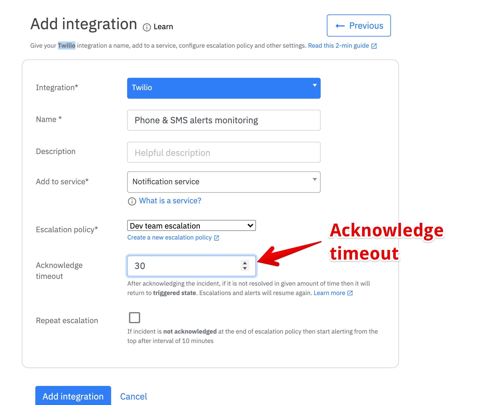

# Acknowledge timeout

## What is acknowledge timeout?

After acknowledging the incident, if it is not resolved in given amount of time then it will return to **triggered state**. Escalations and alerts will resume again.

Many-a-times, you or your team-mate would acknowledge an incident but never get around to resolving it for multitude of reasons. This is where the **acknowledge timeout** feature comes in handy.&#x20;

You can set acknowledge timeout **in minutes** to all of your new and existing integrations by editing a service or adding a new service.&#x20;

### What is an ideal Acknowledge timeout?

This really depends on the integration. The more critical it is the shorter the timeout should be.&#x20;

_Here's what we recommend -_

1. Critical integration - **20 minutes**
2. Severe but not critical integration - **60 minutes**
3. Non-severe and non-critical integration - **Leave it blank.**

You don't need an Acknowledge timeout for _every integration._&#x20;


Please make sure to keep a generous timeout and **avoid keeping short times like 5 or 10 minutes**. Keeping short timeouts will end up in way too many alerts you did rather ignore.

