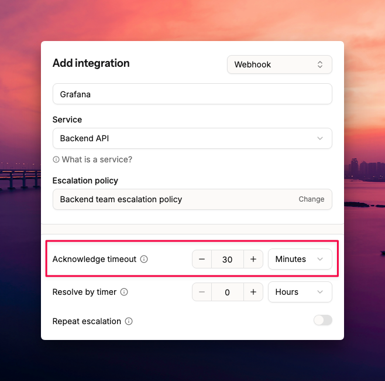

# Acknowledge timeout

Acknowledge timeout is a time limit you set on an integration. If an acknowledged incident isn't resolved within that window, Spike moves it back to triggered state and resumes alerting. This is useful when someone acknowledges an incident but gets pulled into other work before resolving it.

<figure><figcaption>
Set acknowledge timeout in minutes on any integration.
</figcaption></figure>

## What timeout should you set?

It depends on how critical the integration is. A shorter timeout means faster re-alerting on unresolved incidents.

- **Critical integrations** — 20 minutes
- **Severe but non-critical integrations** — 60 minutes
- **Non-critical integrations** — leave it blank

You don't need a timeout on every integration.


Avoid short timeouts like 5 or 10 minutes. They generate more alerts than your team can act on and increase alert fatigue.

