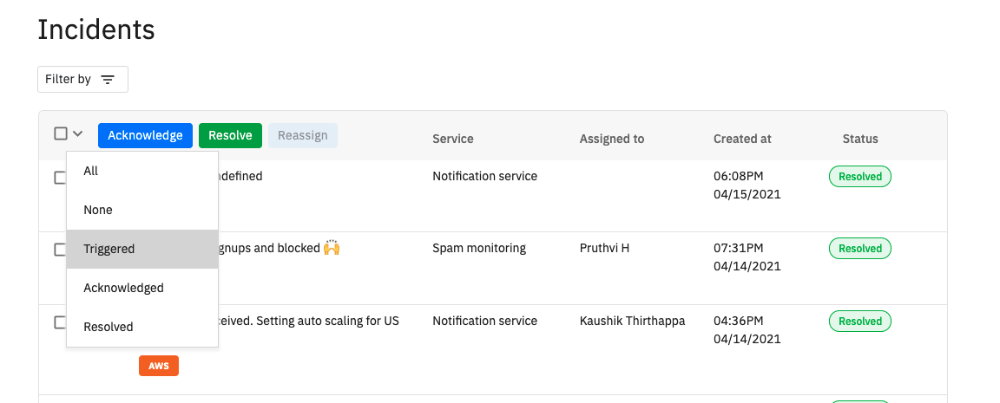
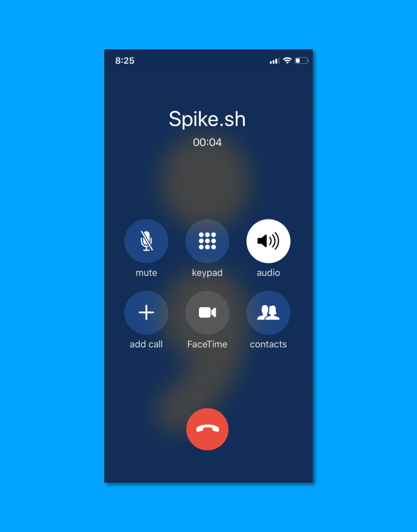
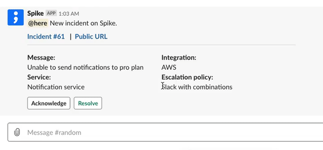

# How to change incident status?

## From the dashboard

You will see open incidents on the [dashboard](https://app.spike.sh). Select a single incident with the checkbox on the left-hand side and hit the **Acknowledge** button on top. Similarly, you can choose to **Resolve** by using the adjacent button.

### Multiple incidents

Alternatively, you can choose multiple incidents to change status by selecting each incident or use the dropdown to quickly select all incidents that match the criteria.

## From phone call

On the phone alert, you can take immediate actions by - 

1. **Press 4 to Acknowledge**
2. **Press 6 to Resolve**
3. **Press 9 to Escalate**

Phone calls are restricted to 420 characters which we believe should suffice to give you the context of the incident. 


You will get a voice confirmation on the same call upon incident status change


## **From Slack**

All alerts on Slack will have actionable buttons to **Acknowledge** and **Resolve** incidents.


Upon status change, the relevant Slack messages will update to reflect them. This also applies if anyone changes the status via Phone, Email, SMS, or from the Dashboard too. 


## **From Email**

Use the following actions to change incident status directly from email by replying - 

1. **#res** to resolve
2. **#ack** to acknowledge


Upon status change, we do not send a confirmation


## **From SMS**

Send Spike.sh an SMS from your registered phone number to change incident status. 

1. **#\<incident_id> res** to resolve. (example: #2071 res)
2. **#\<incident_id> ack **to acknowledge. (example: #1226 ack)

The SMS action doesn't depend on replying to our message. It only relies on you sending us a message. This means if you don't have SMS in your escalation policy and then choose to perform the above action, it would still work. 


Upon status change, we do not send a confirmation


## From mobile website

Our dashboard page and incident details page are mobile compatible. You can check open incidents and relevant incidents on your mobile and change incident statuses. 

.png>)


visit [https://app.spike.sh](https://app.spike.sh) on mobile to access the dashboard.


