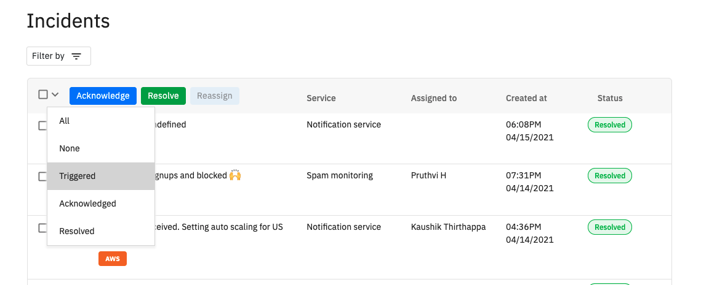
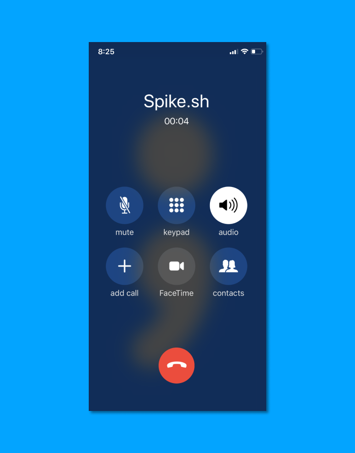
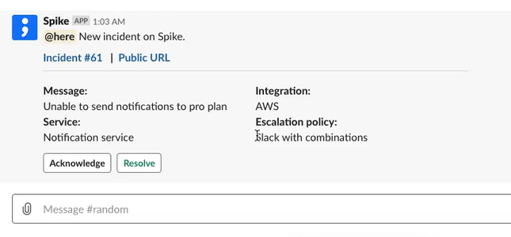

# How to change incident status

You can change an incident's status from multiple places: the dashboard, a phone call, Slack, email, SMS, or mobile.

## From the dashboard

<figure><figcaption>
Select incidents and change their status from the dashboard.
</figcaption></figure>

Open the [dashboard](https://app.spike.sh) to see all open incidents. Select an incident using the checkbox on the left, then click **Acknowledge** or **Resolve** at the top.

### Multiple incidents

Select multiple incidents using the checkboxes, or use the dropdown to select all incidents matching a specific criteria. Then apply the status change in bulk.

## From a phone call

<figure><figcaption>
Use keypresses during a phone alert to change incident status.
</figcaption></figure>

During a [phone alert](../alerts/phone.md), press a key to take action immediately:

1. **Press 4** to acknowledge
2. **Press 6** to resolve
3. **Press 9** to escalate

You'll hear a voice confirmation on the same call once the status changes.

## From Slack

<figure><figcaption>
Slack alerts include Acknowledge and Resolve buttons.
</figcaption></figure>

Every [Slack alert](../alerts/slack.md) includes **Acknowledge** and **Resolve** buttons. When you change the status, all related Slack messages update to reflect it. This applies regardless of whether the change was made via phone, email, SMS, or the dashboard.

## From email

Reply to a [Spike email alert](../alerts/email.md) with one of the following:

1. **#ack** to acknowledge
2. **#res** to resolve

No confirmation is sent after the status change.

## From SMS

Send an SMS from your registered phone number to change status. You don't need to reply to a Spike message — just send a new one:

1. **#\<incident\_id> ack** to acknowledge (example: `#1226 ack`)
2. **#\<incident\_id> res** to resolve (example: `#2071 res`)

This works even if [SMS](../alerts/sms.md) is not in your escalation policy. Spike processes the action as long as you send from your registered number.

## From mobile

The dashboard and incident detail pages are mobile-compatible. Visit [app.spike.sh](https://app.spike.sh) on your mobile browser to view open incidents and change their status.

<figure><figcaption>
View and manage incidents from your mobile browser.
</figcaption></figure>
