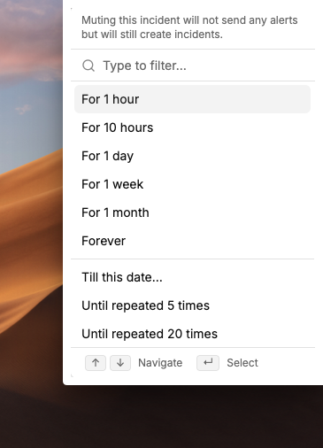

# Mute alerts

Muting stops all alerts for an incident and its repeated occurrences for a set period. The incident stays open and logged. Spike just stops notifying your team about it.

This is useful for low-priority incidents you're aware of but don't need to act on immediately. Instead of getting alerted repeatedly, you mute it and come back when you're ready.

<figure><figcaption>
Mute alerts on an incident for a set duration.
</figcaption></figure>

## Mute duration options

- 1 hour
- 10 hours
- 1 day
- 1 week
- 1 month
- Forever


Use **Forever** carefully. Muting an incident permanently means your team will never be alerted about it again, even if it keeps recurring.

