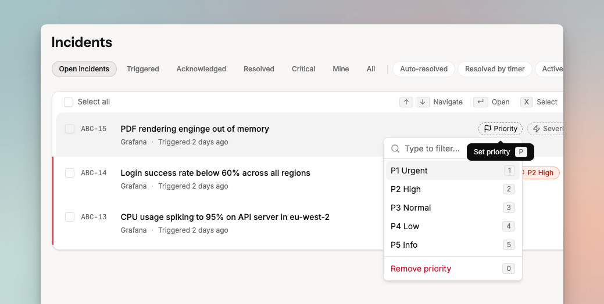
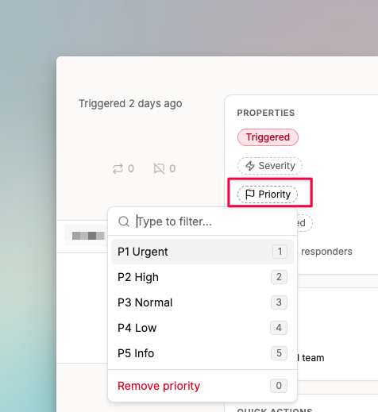

# Priority and severity

Not all incidents need immediate action. Priority and severity give your team two ways to classify an incident: how urgent it is to fix, and how much damage it's causing.

## Priority

Priority indicates the urgency to resolve an incident. Available priorities are:

- **P1**: Urgent
- **P2**: High
- **P3**: Medium
- **P4**: Low
- **P5**: Info

For example, a billing service outage is a P1. A database server running low on storage might be a P2.

## Severity

Severity indicates the degree of damage to your systems. Available severities are:

- **SEV1**: High
- **SEV2**: Medium
- **SEV3**: Low

For example, a data leak or full service outage is a SEV1. A degraded non-critical service might be a SEV3.


Once you set priority and severity on an incident, Spike remembers them for future occurrences of the same incident.


## Setting priority and severity

### From the dashboard

Select one or more incidents. The priority, severity, and mute options appear at the top of the list.

<figure><figcaption>
Select incidents from the dashboard to set priority and severity in bulk.
</figcaption></figure>

### From the incident page

Open any incident to find the priority and severity options on the incident detail page.

<figure><figcaption>
Set priority and severity directly from the incident page.
</figcaption></figure>

### From integrations

Some integrations, like Azure, send priority and severity as part of their incident payload. Spike reads these values and sets them automatically, overwriting any existing values.

You can also send priority and severity via [webhook integration](../integrations-guideline/integrating-with-webhooks.md).

### From alert rules and Playbooks

You can set priority and severity automatically using [alert rules](../alerts/alert-rules.md) based on incident properties. [Playbooks](../playbooks/introduction-to-playbooks.md) can also set them as part of an automated response when an incident fires.

## FAQ

### Should I set both priority and severity?

For critical incidents, yes. For lower-signal integrations, you can use just one or neither. Both fields are optional.

### Who can set priority and severity?

Everyone on the team. There are no restrictions on who can set or change these fields.

### Can I set priority and severity automatically?

Yes. Use [alert rules](../alerts/alert-rules.md) to set them based on incident properties, or connect integrations like Azure that send these values automatically with each incident.
