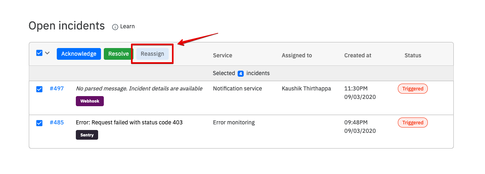

# Reassign incidents

### How to reassign incidents?

Select any number of incidents and click on **reassign** on the header of the incidents table. 

You can reassign an incident to a team member. Not all incidents will have assignee to it, especially when you have Slack app notifying you on channels.

.png>)

Once reassigned, the user will get an email notifying them about it. 

### What happens to escalations?

Your escalation policy for the incident _will NOT be affected_. It will continue as is. 

### Where do I reassign incident(s)?

You will see the reassign incident option on every incident table. More particularly it can be found on -

1. Dashboard
2. Incident details page
3. Incidents listed for a service


You cannot assign an incident to a team member with **Support role**

