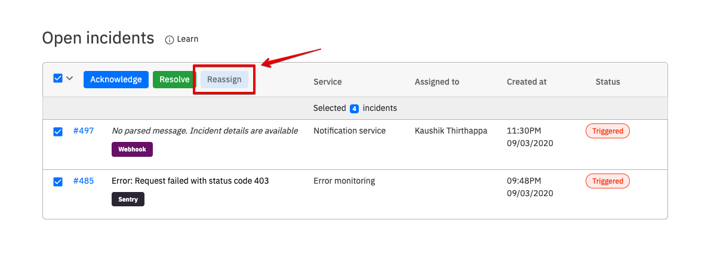

# Reassign incidents

You can reassign any incident to a team member. Once reassigned, they receive an email notification.

## How to reassign

Select one or more incidents and click **Reassign** in the incidents table header.

<figure><figcaption>
The Reassign button appears in the incidents table header after selecting an incident.
</figcaption></figure>

<figure><figcaption>
A reassigned incident shows the new assignee.
</figcaption></figure>

The reassign option is available from:

- Dashboard
- Incident details page
- Incidents listed for a service


You cannot reassign an incident to a team member with the **Support** role.


## Effect on escalations

Reassigning an incident does not affect the escalation policy. The policy continues running as configured.
