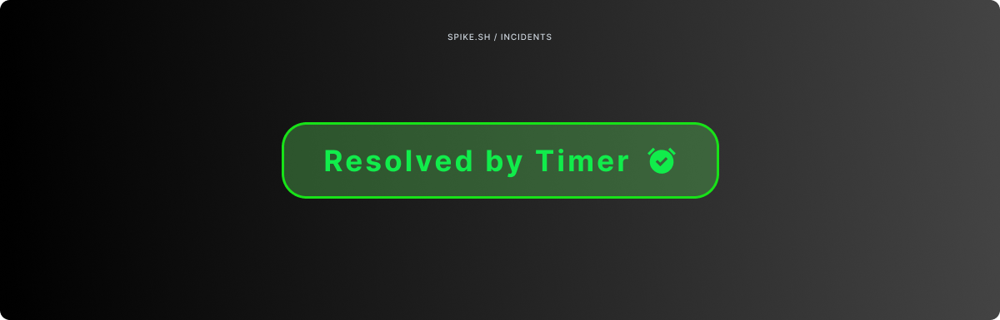
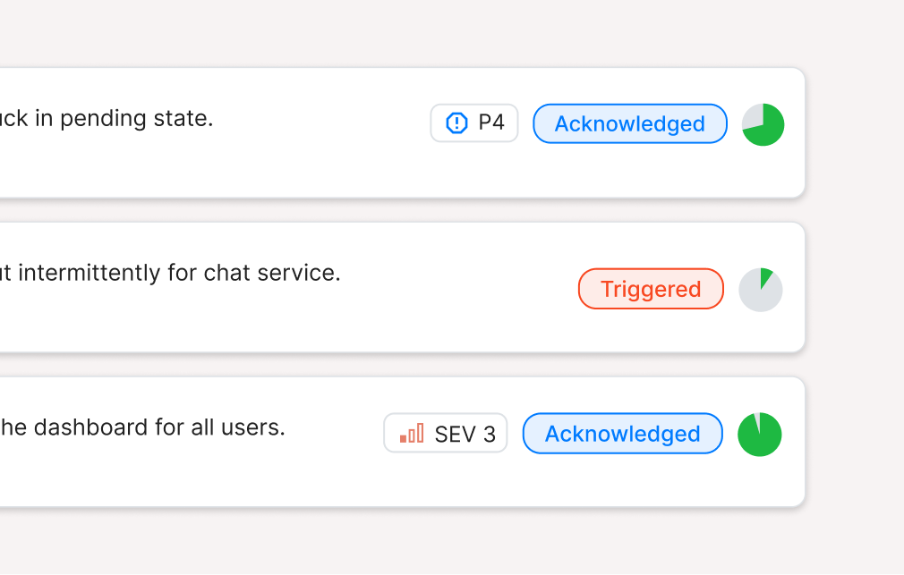
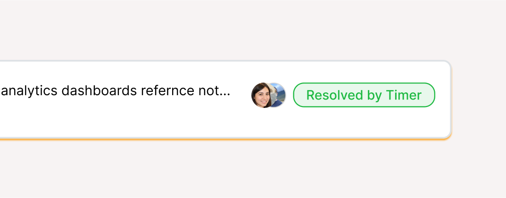
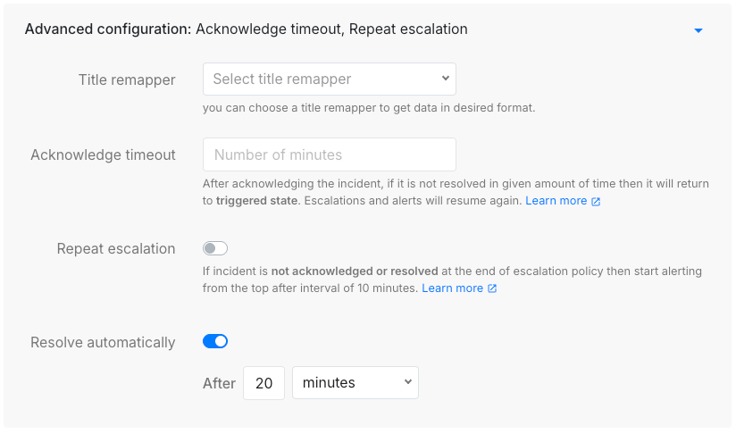
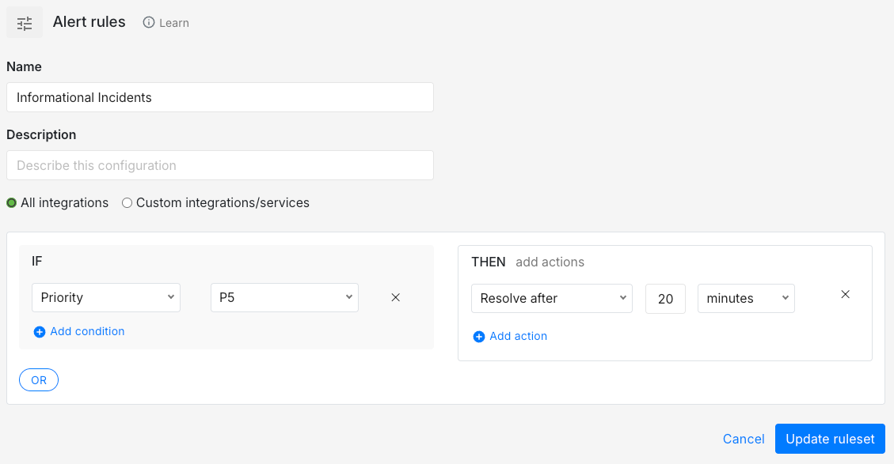
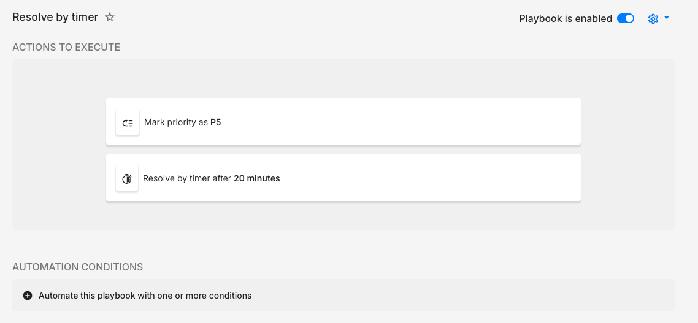

# Resolve by Timer

<figure><figcaption>
Resolve by Timer on Spike.
</figcaption></figure>

## What is Resolve by Timer?

Resolve by Timer automatically resolves an incident after a set duration. When an incident triggers, a countdown starts. If the incident isn't resolved before the countdown ends, Spike marks it as **Resolved by Timer**. You can cancel the timer at any point from the incident view.

You can set up Resolve by Timer in three ways:

- **Integration level**: applies to all incidents from an integration
- **Alert rules**: applies only when certain conditions are met
- **Playbooks**: applies as part of your response playbook


Resolve by Timer is available on all plans.


## How it works

<figure><figcaption>
The timer countdown visible on an incident.
</figcaption></figure>

When an incident triggers, a countdown begins automatically. The incident behaves normally during this time. It can be acknowledged, updated with notes, or manually resolved at any time.

If the countdown ends and the incident is still open, Spike marks it as **Resolved by Timer**. A badge and countdown indicator appear on the incident row and detail page.

<figure><figcaption>
The badge shows the incident was resolved by timer.
</figcaption></figure>

## How to set up Resolve by Timer on an integration

**Best for:** Applying the same timer to all incidents from a specific integration.



When editing or creating your integration, scroll to **Advanced Configuration** and locate the **Resolve by Timer** toggle.


Toggle **Resolve by Timer** on, enter your time value, select the unit (**Minutes**, **Hours**, or **Days**), and click **Save**.



<figure><figcaption>
Setting Resolve by Timer at the integration level.
</figcaption></figure>

## How to set up Resolve by Timer with alert rules

**Best for:** Applying timers only to incidents that meet specific conditions.



While editing or creating an alert rule, set up your conditions to define which incidents the rule applies to.


In **Actions**, select **Resolve by Timer**. Enter the time value and select the unit (**Minutes**, **Hours**, or **Days**), then save or update the rule.



<figure><figcaption>
Setting Resolve by Timer via alert rules.
</figcaption></figure>

## How to set up Resolve by Timer in playbooks

**Best for:** Including a timer in your incident response workflow.



While editing or creating a playbook, add an action to apply Resolve by Timer.


Choose when the timer should start: immediately on trigger, or when the incident status changes to **Acknowledged**.



<figure><figcaption>
Setting Resolve by Timer via playbooks.
</figcaption></figure>

## FAQs

### Can I remove the timer for a specific incident?

Yes. Click the remove timer button on the incident to cancel it.

### Can I set different times for different severity levels?

Yes. Use alert rules to apply different timers based on incident severity.

### What is the minimum resolution time?

1 minute. For most use cases, 15 to 30 minutes is a more practical minimum.

### Will I be notified when an incident resolves by timer?

This depends on your notification settings. You can configure alerts for resolved incidents.
