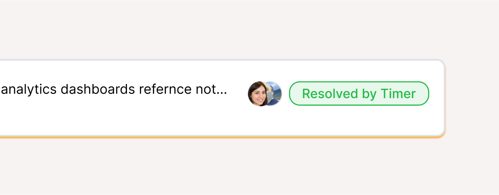

<figure><figcaption></figcaption></figure>

## Introduction
**Resolved by Timer** lets you automatically resolve incidents after a fixed duration. Once an incident is triggered, a countdown starts. If the incident hasn’t been manually resolved by the time the countdown ends, Spike will mark it as Resolved with Timer.

You’ll see a badge on the incident row and incident page, along with a visual indicator showing the timer. You can cancel the timer at any point from the incident view.

<figure><figcaption></figcaption></figure>

Resolve Timer can be set up in multiple ways:

**Integration-level**: apply the same timer to all incidents from an integration.

**Alert rules**: apply timers only when certain conditions are met (e.g., based on severity or service).

**Playbooks**: apply timers as part of your playbook.


Resolve Timer is available on **all plans**.


---

## How it works?

When an incident is triggered, a countdown begins automatically. This timer runs in the background while the incident behaves like any other — it can be acknowledged, updated with notes, or manually resolved at any time.

If the countdown finishes and the incident is still open, Spike marks it as Resolved with Timer. A badge and countdown indicator appear on the incident row and detail page, making it clear when and how the resolution happened.

---

## Setup Resolve timer on integration level
Use this when you want every incident from a specific integration to resolve after a set time.



When **Editing**/**Creating** your integration scroll to **Advanced Configuration** and locate the **Resolve Timer** toggle.


Toggle **Resolve Timer** to **ON**, enter your time value, select the unit (**Minutes**, **Hours**, or **Days**), and click **Save**.



Example: Setting 24 hours will automatically resolve all incidents from this integration after 24 hours.

.png)

## Setup Alert Rule-based Resolve timer
Use this for granular control over which incidents to set a timer for.



While **Editing**/**Creating** an alert rule, set up your alert conditions to define which incidents should trigger this rule.


In **Actions** select **Resolve After**. Enter the time value, select the unit, then **Save** or **Update** the rule.



Example: Database incidents automatically resolve after 2 hours if not manually handled.

.png)

## Setup Resolve timer in Playbooks
Use this to set timer as part of your response playbook



While **editing** or **creating** a playbook, add an action to apply a Resolve Timer.  


You can choose when the timer should start — for example, immediately on trigger or when the incident status changes (e.g., to **Acknowledged**).  



.png)

---

## FAQ

Can I Remove Timer for specific incidents?

Yes, You can remove it from the incident by clicking on the remove timer button.

Can I set different times for different severity levels?

Yes, using alert rules you can create different configurations based on incident severity, service, or other conditions.

What's the minimum resolution time?

1 minute, though we recommend at least 15-30 minutes for most use cases.

Will I get notified when incidents resolve by timer?

This depends on your notification settings. You can configure to get alerts on resolve incidents

---

*If you need help setting up Resolve Timer, reach out to [support@spike.sh](mailto:support@spike.sh).*