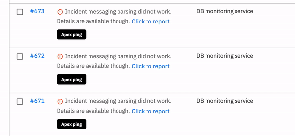

# Why does message parsing fail?

## Message parsing failed

After you setup integrations on Spike.sh, these integrations send us payload of JSON data for every new incident. We convert this JSON data into a human-readable format which is then used on the [incidents table](https://app.spike.sh/incidents) and in phone calls, emails, Slack etc. 

Sometimes, this parsing fails and your table might see an entry like below - 

### Report with a single click

When you see this, please report this issue to us so we can start looking into this. The more you report the better this parsing gets.

### Why does this happen?

We try our best to parse all the payloads and convert it into a gist you can actually read and get a sense of the incident. Each integration has tons of cases and our parser fails to understand it and that's what causes Incident message parsing fail. 

### Does it affect my alerts?

Yes, your alerts will not have the message. 

### Would I still receive alerts?

Yes. Alerts will still be sent however the exact incident message will not be available. 

### Is the incident affected?

No. The details of your incident are still available. You can click on the \#ID of the incident and see all the details as you do with other incidents.

### Should we take any action?

We would love it if you can please report the incident. 


Once the parser is fixed, it will not change the message for existing incidents but it will surely pave the way for future incidents


