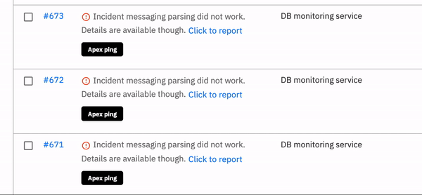

# Why does message parsing fail?

When an integration triggers an incident, Spike parses the JSON payload into a readable format. Some integrations send payloads in formats the parser doesn't recognise, and that's when it fails.

<figure><figcaption>
An incident with a failed message parse in the incidents table.
</figcaption></figure>

## Does it affect alerts?

Yes. Alerts still go out, but the incident message won't be included.

## Does it affect the incident?

No. The incident is still created and all details are available. Click the incident ID to view the full details.

## Report a parsing failure

When you see a parsing failure, report it with a single click. Each report helps improve the parser for future incidents.

<figure><figcaption>
Report a parsing failure directly from the incidents table.
</figcaption></figure>


Once the parser is fixed, existing incidents won't be updated. The fix applies to new incidents only.

