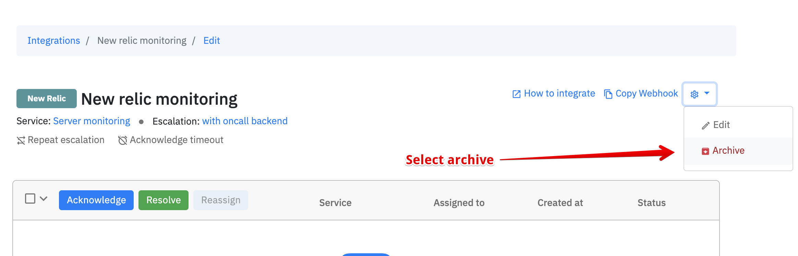
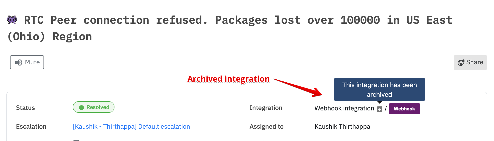

# Archive an integration

## How to archive an integration?

You can choose to archive any integration. Visit the integrations page, select an integration and click archive. 


Once the integration is archived, no new incidents will be created


### Is it possible to retain a webhook after archiving?

No. Once you archive any integration (ex: AWS) and then create a new one (ex: AWS) then the webhook will be different than the archived one.

### Does this affect existing incidents?

No. In fact, the existing incidents will prompt you about archived integration to avoid misinformation. 

### How to restore an integration?

There is no automated process. If you certain about restoring then talk to us via chat from the dashboard or email us at [support@spike.sh](mailto:support@spike.sh)
