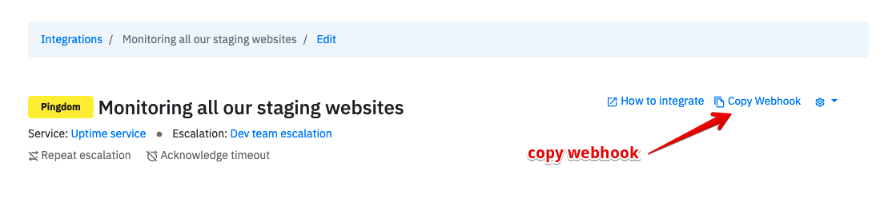
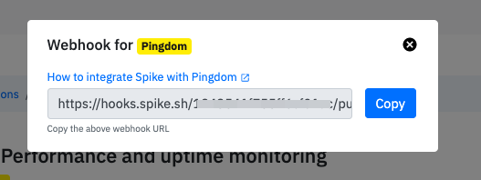

# Create integration and service on our dashboard

## **What is a service?**

**You can think of services as a microservice.** Services are a way to scope your internal services from your architecture. Each of your services can have multiple integrations and you can create an unlimited number of services. We highly encourage you to create different services for each of your different modules.

[Learn more about services](https://docs.spike.sh/services/introduction-to-services-on-spike).

## Adding service

You can create a new service by clicking on the [New Service button](https://app.spike.sh/services/new) on the [services page](https://app.spike.sh/services).

Give it an appropriate name, **for ex: Billing service**. \( This way you can also integrate your payment gateway by adding another integration for every time payments fail \). Hit **Create service!**  

Once the service is created you will be able to see an overview of your service with all of it's integrations. 

### Adding integration

From the header, select Add integration. Optionally, on the sidebar select integrations and then add integration.

[Acknowledge timeout](https://docs.spike.sh/incidents/acknowledge-timeout) and repeat escalations are optional but we highly recommend it. 

The last bit on our dashboard is the final step of copying the webhook to be used on Pingdom used as an example here. 

So, get the webhook by clicking on the **Copy Webhook** button.


Make sure to use the Pingdom webhook in Pingdom. Using it on other integrations might not give you the proper incident messages and will not reliably group repeated 



Not able to find an integration you are looking for?? Use the **Webhook** integration instead and paste it on any service. 


