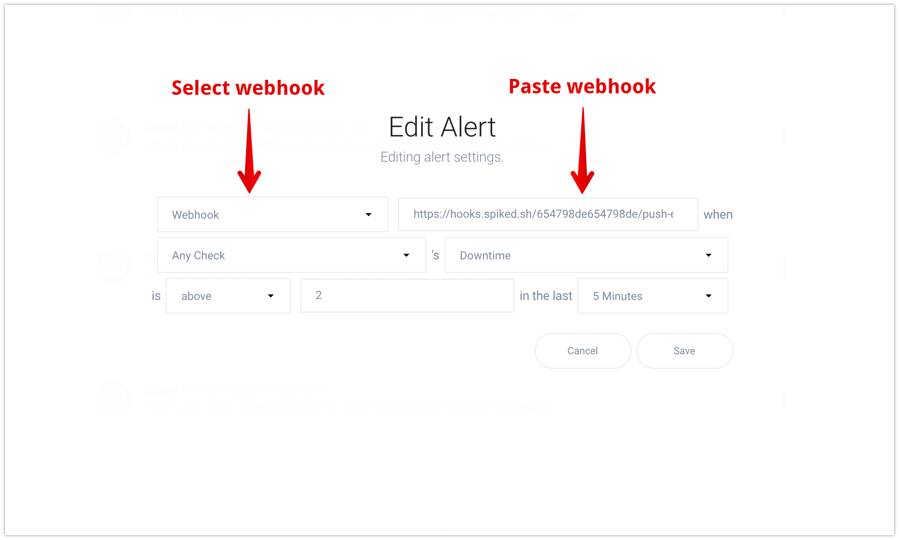

# Integrate Spike with Apex ping

## Service and Integration

Make sure you have the service and integration already setup for Apex ping. Follow the link below on instructions of how to create integration and service



## Use the webhook on Apex ping

Login into [Apex.sh/ping](https://ping.apex.sh/) account and visit the [alerts page](https://ping.apex.sh/alerts) to being your integration.

Click on **add alerts**

On the alerts page, you can add or edit an alert.

1. Select **Webhook** from the dropdown.
2. Paste the webhook
3. Customize your settings for alerts and **save.**


This integration supports auto resolution.


## FAQ

1. **How many services and integrations can I create on Spike?**
   * Unlimited
2. **How many escalation policies can I have on Spike?**
   * Unlimited

At Spike, we are working hard to integrate with all the tools your business uses. We are on a mission to help **you** identify incidents/crashes/spikes before your customers do.

If you have any integration in mind and would like us to build it for you then contact us at [support@spike.sh.](mailto:support@spike.sh)

