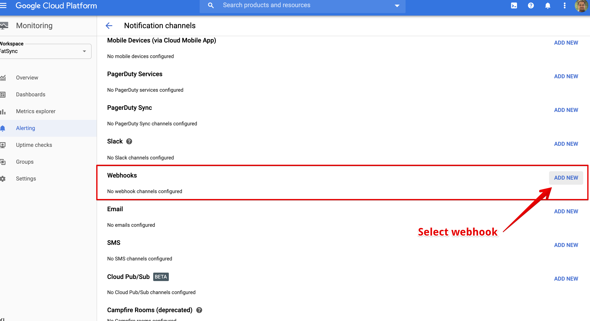
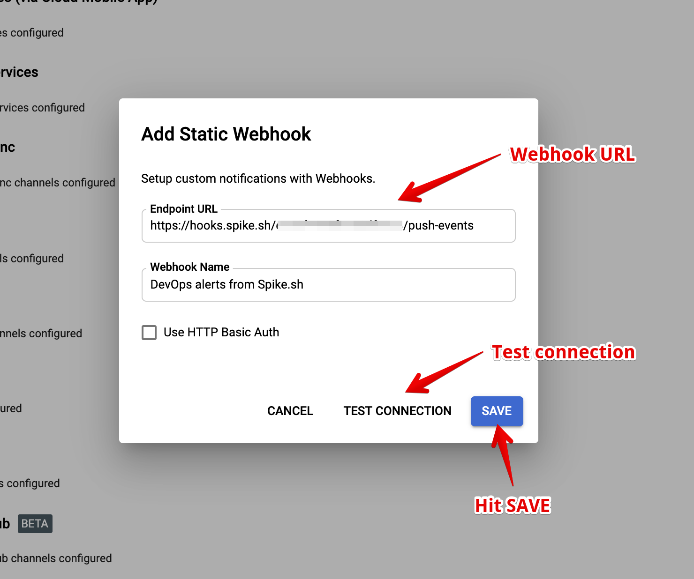
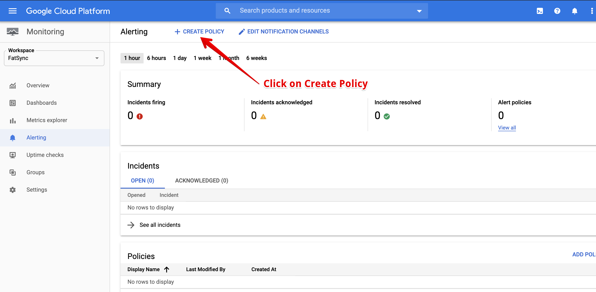
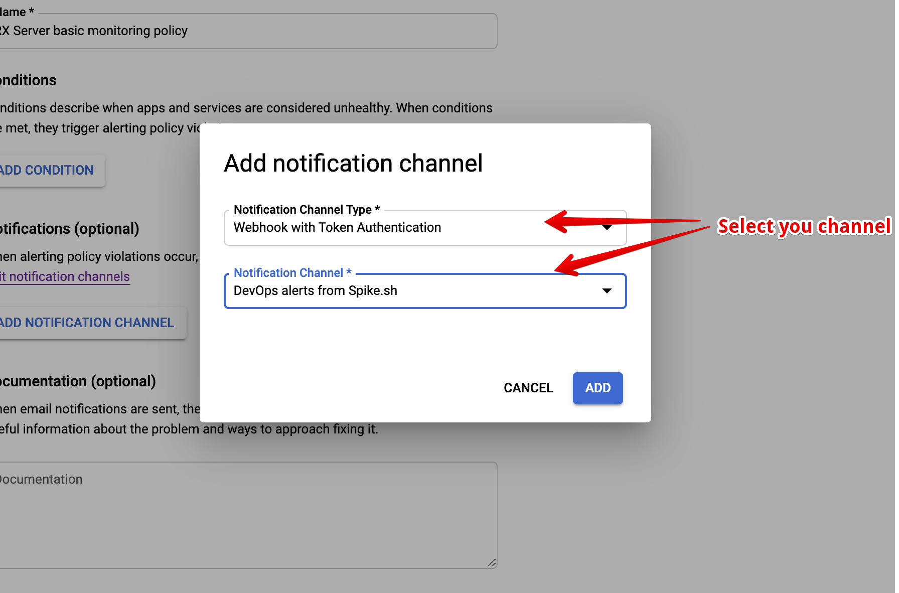

# Integrate Spike with Google Cloud

## Service and Integration

Make sure you have the service and integration already setup for Google Cloud. Follow the link below on instructions of how to create integration and service


[create-integration-and-service-on-dashboard.md](create-integration-and-service-on-dashboard.md)


## Use the webhook on Google Cloud

We will create a webhook on Stackdriver to integrate directly with Spike. There is no limit to the number of Spike's webhooks you can add on Google Cloud


Updated Google Cloud integration docs on 8th May 2020.


Login to your [Google Cloud console](https://console.cloud.google.com/) and find [Monitoring](https://console.cloud.google.com/monitoring) on the sidebar

 (1).png>)

Enter the webhook you copied earlier. _You can choose to have Basic Auth enabled. Every integration will have a unique username password combination._

**Hit Test Connection and Save**


Testing your webhook will create a test incident. Resolve the test incident immediately. This test incident will not have any metrics though.



If it fails, make sure you have pasted the right username and password. Refresh the page after a few tries. We are always available on the Live chat on your dashboard. You can also reach out to us on [support@spike.sh](mailto:support@spike.sh)


Go to the [monitoring section](https://console.cloud.google.com/monitoring) again and click on Create policy.

.png>)


For your existing policies, you can simply edit and choose the same steps mentioned


Inside of Notifications, click on the dropdown menu and select **Webhook with Basic Authentication**.

## FAQ

1. **How many services and integrations can I create on Spike?**
   * Unlimited
2. **How many escalation policies can I have on Spike?**
   * Unlimited
3. **How many SNS topics can I create on AWS?**
   * Unlimited.

At Spike, we are working hard to integrate with all the tools your business uses. We are on a mission to help **you** identify incidents/crashes/spikes before your customers do.

If you have any integration in mind and would like us to build it for you then contact us at [support@spike.sh.](mailto:support@spike.sh)
