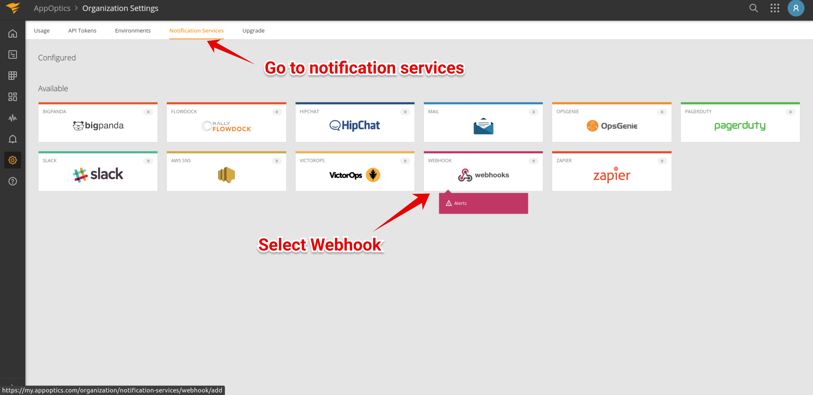
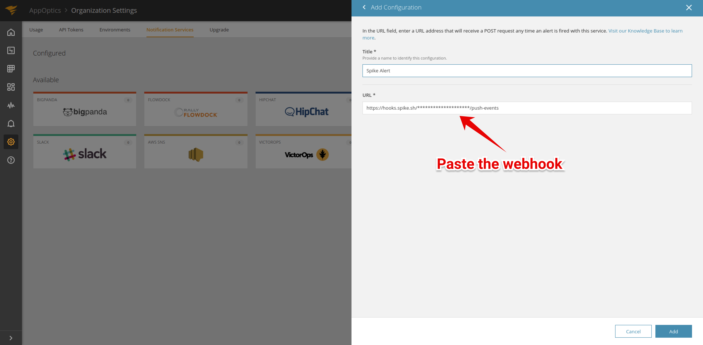

# Integrate Spike with App Optics

### Service and integration

Make sure to add the App Optics integration and copy the webhook. 



### Using webhooks with App Optics

**Step 1**

From the dashboard navigate to **organization settings** and then go to **notification services**.

Select webhooks from the available integrations.

**Step 2**

Paste the Spike webhook URL and save.


This integration auto resolves.


