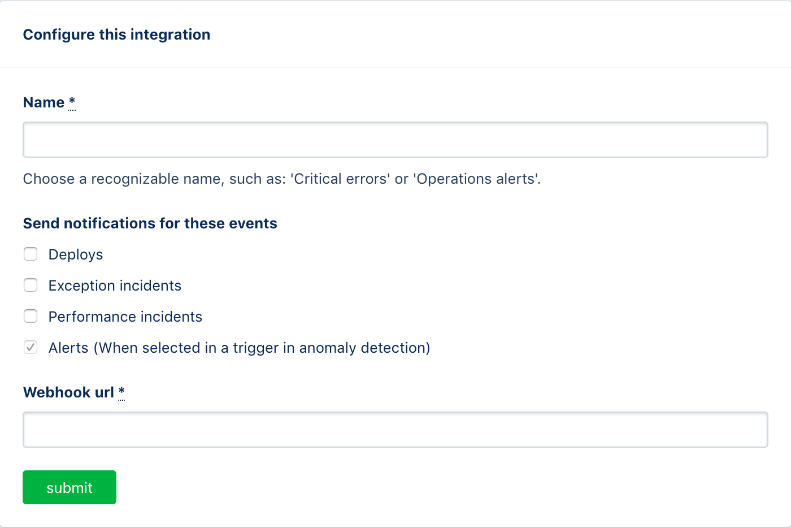

# Integrate Spike with AppSignal

## Service and integration

When the bits hit the fan, developers need clear and focused insights. [AppSignal](https://appsignal.com) combines 5 powerful monitoring features into one powerful APM. 



## Using our webhook on AppSignal

To integrate our webhook on AppSignal, visit their dashboard and go to the "Notifications" tab the site's sidebar, click the "Add integration" and paste the webhook you copied from Spike.sh

Give an appropriate name on AppSignal as it might appear in alerts for some cases.


Only alerts \(anomaly detection\) incidents will **auto-resolve**.


