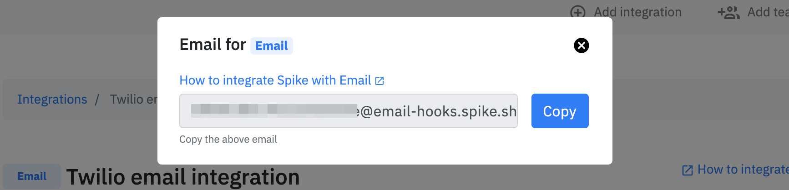

# Integrate Spike with AppViewX

[AppViewX](https://www.appviewx.com/) manages the lifecycle of your certificates. Its expiry alerts tell you which certificates are about to run out, and Spike turns those alerts into an incident that escalates through your on-call policy instead of sitting in somebody's inbox.

AppViewX sends expiry alerts by email and by SNMP trap, and has no webhook for them, so this integration uses Spike's email pipeline. You create an AppViewX integration in Spike, copy the email address it gives you, and add that address as a recipient on an AppViewX expiry alert. Nothing is installed anywhere and there is no code to write.


AppViewX expiry alerts are scheduled reminders, not alert-and-recover events. AppViewX sends nothing when a certificate is renewed, so **incidents from this integration never resolve themselves**. That is how AppViewX works rather than a gap in the integration: a [resolve timer](../incidents/resolve-timer.md) or resolving by hand is the way these incidents close, permanently. Step 4 below sets one up.


## What Spike does with each email

| AppViewX email | What happens in Spike |
| --- | --- |
| The first reminder for a threshold, for example "expiring in 30 days" | Opens an incident titled with the email's subject and pages your escalation policy |
| Every later reminder with the same subject | Added as an event to the incident already open. It never pages again |
| A reminder with a different subject, for example "expiring in 7 days" | A separate incident, which pages again |
| A certificate is renewed | AppViewX sends nothing at all, so Spike sees nothing |

One email covers every certificate that matched the alert, so one incident covers them all too. An expiry alert that finds nine certificates expiring in 30 days is one page for the person on call, not nine.

## How incidents are titled, and how they group

The subject line of the email is the incident title, and it is also the only thing Spike groups on. The body of the email becomes the incident's details.

This works out well for AppViewX, because **the subject is a field you fill in yourself when you create the expiry alert** — AppViewX does not generate it. Every reminder that alert sends carries exactly the same subject, so every reminder lands on the same incident, and a second alert with a different subject is a second incident. That is the whole of the grouping behaviour.

Write the threshold into the subject and keep everything that changes out of it:

```
AppViewX: certificates expiring in 30 days
```


Do not put a date, a certificate count or a certificate name in the subject. `AppViewX: 9 certificates expiring on 12 Oct` is a different subject next week, so it opens a fresh incident and pages your team again for a threshold they have already seen. Put those details in the body, where they belong.


Because the subject is fixed text rather than something AppViewX builds per certificate, grouping holds no matter how AppViewX batches the reminder. One email listing nine certificates and nine separate emails for the same alert both carry the same subject, and both land on the same incident.

## One incident per threshold

Most teams want more than one warning before a certificate expires. Each warning is a separate expiry alert in AppViewX with its own subject, which gives you a separate incident in Spike:

| AppViewX expiry alert | Subject to use | What on-call sees |
| --- | --- | --- |
| Expires in 30 days | `AppViewX: certificates expiring in 30 days` | An incident that opens once and collects every 30-day reminder |
| Expires in 7 days | `AppViewX: certificates expiring in 7 days` | A separate incident, a separate page, a week before the outage |
| Expires in 1 day | `AppViewX: certificates expiring tomorrow` | A separate incident, and the one to point at your loudest escalation policy |

Use AppViewX's **Clone** action on an expiry alert to build the next threshold from the last one. Change the number of days and the subject, and leave the recipient alone.


[Alert rules](../alerts/alert-rules.md) can match on the title, so the 1-day incident can go to a different escalation policy, or come in at a higher [severity](../incidents/priority-and-severity.md), than the 30-day one.


## Prerequisites

* An AppViewX account with permission to create expiry alerts
* SMTP configured in AppViewX, which is what its email alerting sends through
* An AppViewX integration in Spike and its email address

## Step 1 — Create the integration in Spike

In Spike, go to **Integrations → Add integration → AppViewX**, attach it to a service and an escalation policy, and copy the email address from the integration page. It is unique to this integration and it is what authenticates the alerts, so treat it like a secret.




[create-integration-and-service-on-dashboard.md](create-integration-and-service-on-dashboard.md)


There is no inbox behind that address. Spike reads the mail and throws it away.

## Step 2 — Point an AppViewX expiry alert at that address

Where you configure expiry alerts depends on which part of AppViewX you use. The result is the same either way: an email notification whose recipient is the Spike address.



1. Go to **Alert → Settings** and open the **Certificate** tab.
2. Give the alert a **name**, set **Severity** to **Critical**, and select **Certificate expiry alert** as the **Event type**.
3. In **Expires in (days)**, enter how many days before expiry this alert should fire, for example `30`.
4. Select the **Email configuration** check box.
5. Paste the Spike email address into the email address field. Other recipients can be added to the same field, separated by commas.
6. Replace the default text in **Subject** with a subject that names the threshold, for example `AppViewX: certificates expiring in 30 days`. This is the incident title in Spike, so it is worth more thought than the rest of the form.
7. Click **Add**. The alert appears on the **Certificate** tab.



1. Go to **KUBE+ → Alerts & Logs → Expiry Alerts** and click **Create**.
2. Give the alert a **name**, then set **Filter By** to the clusters, namespaces or certificates this alert covers.
3. Pick the threshold. **Range in days** and **On specified days** both describe a window before expiry; **Range in dates** covers a fixed period. Any of them works with Spike, as long as one alert means one threshold.
4. Set **Notification Method** to **Email**.
5. Set **Notification Format** to **Email Body**, not **Attachment (CSV)**. See the note below.
6. Put the Spike email address in **To**. The field takes up to 20 recipients, so your team can stay on it alongside Spike.
7. Write the **Subject** so it names the threshold, and write the **Body**. The subject becomes the incident title and the body becomes the incident details.
8. Under **Certificate Parameters**, keep at least **Common Name** and **Valid Until** so the incident says which certificates are expiring and when.
9. Save the alert, then set its **Schedule** — timezone, frequency and start date. **Run Now** is a good way to check the wiring straight away.




Send the certificate list in the email body rather than as a CSV attachment. Spike builds the incident from the subject and the body, so a reminder that carries its list as an attached file opens an incident with nothing in it to act on.


## Step 3 — Check the first reminder

Trigger the alert, with **Run Now** in KUBE+ or by waiting for the schedule, and confirm three things in Spike:

1. An incident opened on the right service and paged the right people.
2. Its title is the subject you wrote, word for word.
3. The incident details list the certificates, with their common names and expiry dates.

Then let a second reminder arrive for the same alert. It should land on the open incident as an event and page nobody. If it opens a second incident instead, the subject is changing between reminders — see [Troubleshooting](#troubleshooting).

## Step 4 — Set a resolve timer

Nothing from AppViewX will ever close these incidents. Renewing a certificate produces no email, and the next reminder for the same threshold simply stops arriving once the certificate is out of the window. Give the integration a [resolve timer](../incidents/resolve-timer.md) so incidents do not sit open forever:

1. Edit the AppViewX integration in Spike.
2. Scroll to **Advanced Configuration** and turn on **Resolve by Timer**.
3. Set a duration a little longer than the gap between reminders, so an unrenewed certificate pages again rather than going quiet.

| Reminder schedule | Suggested resolve timer |
| --- | --- |
| Daily | 2 days |
| Weekly, the AppViewX default for discovered certificates | 8 days |
| Once per threshold | 1 day, so the incident closes soon after it is dealt with |

Each new reminder is added to the open incident but does not restart the timer. If the timer fires while the certificates are still unrenewed, the next reminder opens a fresh incident and pages again, which is what you want for an expiry nobody has got to yet.


Resolving by hand works just as well, and is the honest close for this integration: the incident is done when the certificate is renewed, and only your team knows that. Use the timer as the backstop.


## Severity

AppViewX expiry alerts carry a severity of their own, but it stays in AppViewX — nothing in an email tells Spike how urgent a reminder is. Incidents come in at your integration's default. Set severity per threshold with [alert rules](../alerts/alert-rules.md), matching on the subject you wrote, which is also how you route the 1-day reminder somewhere louder than the 30-day one.

## What this integration does not do

| Not supported | Why |
| --- | --- |
| Auto-resolve | AppViewX sends nothing when a certificate is renewed. Permanent, not a gap waiting on a fix |
| SNMP traps | Spike has no SNMP trap receiver. Use the email notification method |
| One incident per certificate | An expiry alert is a list by design, and Spike treats the reminder as one unit |
| Renew a certificate from Spike | Expiry alert emails carry a renewal link, which lands in the incident details. Follow it into AppViewX |

## Troubleshooting

<details>

<summary>Every reminder opens a new incident</summary>

The subject is changing between reminders. Spike groups on the subject and nothing else, so a subject carrying a date, a certificate count or a certificate name is a new incident every time. Open the expiry alert in AppViewX and make the **Subject** fixed text that names only the threshold, then move the details into the body.

</details>

<details>

<summary>Reminders for different thresholds land on the same incident</summary>

Two expiry alerts are sharing a subject. Give each threshold its own wording, `expiring in 30 days` and `expiring in 7 days`, so each gets its own incident and its own page.

</details>

<details>

<summary>No incident shows up at all</summary>

Check, in this order: that SMTP is configured and working in AppViewX, since expiry alerts go out through it; that the Spike address is on the alert's recipient list with no typo and no stray comma; that the alert's filter actually matches a certificate inside the window, because an alert that finds nothing sends nothing; and that the schedule has started. A second recipient on the same alert is a quick way to see whether AppViewX sent the mail at all.

</details>

<details>

<summary>The incident is empty, or says little more than its title</summary>

The reminder arrived with its certificate list as a CSV attachment. Set **Notification Format** to **Email Body** on the alert. In CLM, check that the alert's body is populated rather than left at its default.

</details>

<details>

<summary>The incident title is AppViewX's default subject</summary>

The **Subject** field was left as it came. That default says nothing about the threshold, so every alert you create shares it and all of them group into one incident. Write a subject per alert.

</details>

<details>

<summary>An incident resolved while the certificate was still expiring</summary>

That is the resolve timer doing its job. It cannot know whether the certificate was renewed, so lengthen the timer past the gap between reminders, or drop the timer and resolve these incidents by hand once the renewal is done.

</details>
