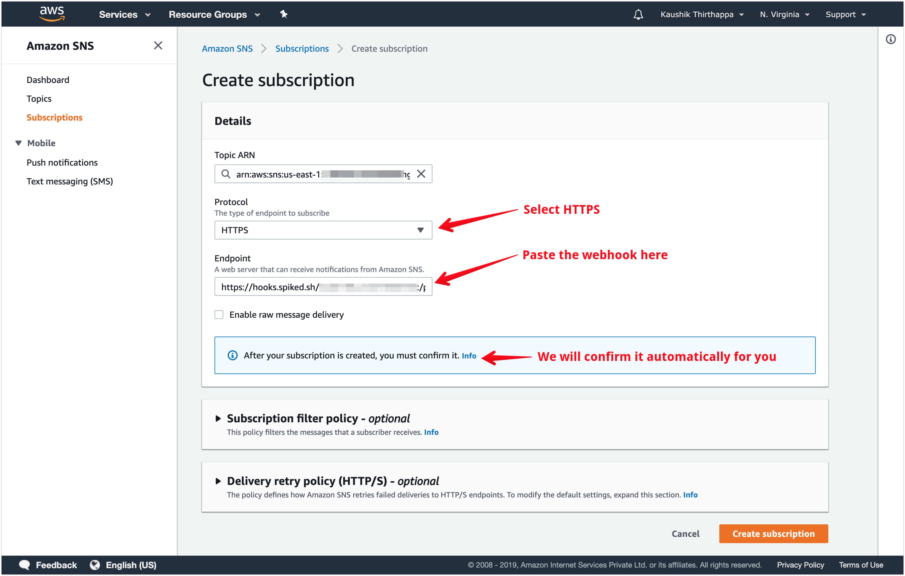
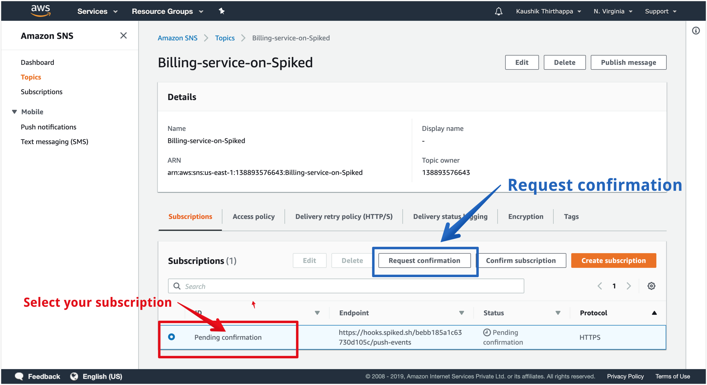
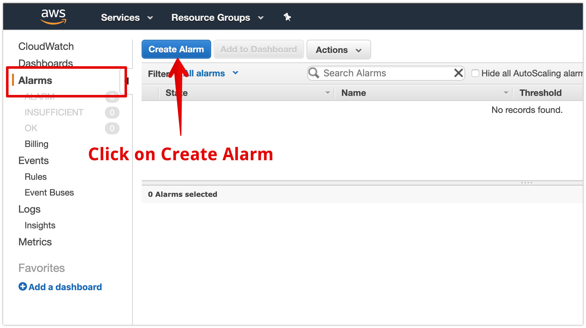
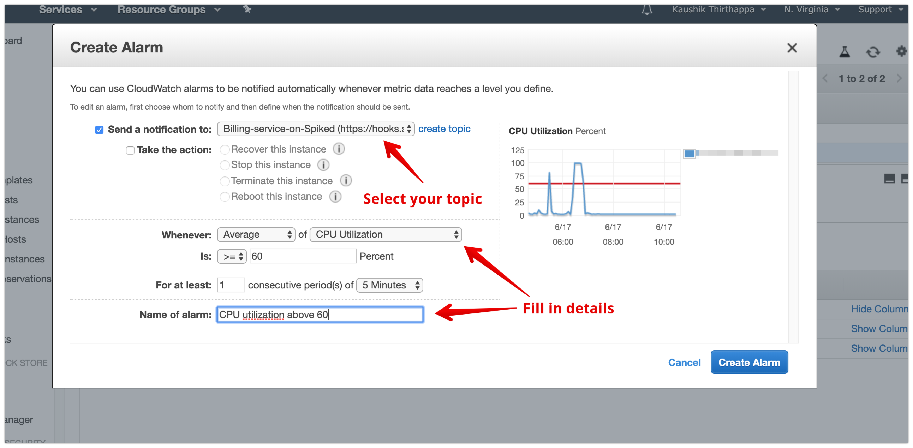

# Integrate Spike with AWS

## Service and Integration

Make sure you have the service and integration already setup for AWS. Follow the link below on instructions of how to create integration and service



## Using the webhook on AWS


We will create a SNS topic and add alarms on say EC2 servers which can be monitored eventually on **Cloudwatch**


Login to your AWS console and head straight to [Simple Notification Service \(SNS\)](https://console.aws.amazon.com/sns/v3/home). 

We will create a topic in SNS which will be available across AWS services.

After your subscription is made, you will be taken to the topic's detail page. **Refresh the page to make sure that the status will be confirmed for the subscription**. If that fails to happen, you can click on the topic page and ask to request confirmation.

Click on **Create topic** and name your topic on the next page.


A good name goes a long way. We recommend you use a name that you and your peers can easily identify. One way is to give the topic your service's name on Spike


Once the topic is created, you will need to create a subscription \(_this is where you paste the webhook you copied from Step 1_\)

Once you created a topic, you will see your topic page like this

Select **HTTPS** as the protocol and paste the copied webhook into the endpoint and click on create subscription at the bottom. _Selecting HTTPS is mandatory._ Spike will automatically confirm the subscription for you.


Make sure to **Refresh** the page on AWS


If the status has not changed then inside the topic, can find the subscription. Select it and request for confirmation.

## Receiving incidents on Spike

We will use the above topic to receive incidents by creating alarms on Cloudwatch. We will also dive into setting up incident alarms directly from EC2.

### Cloudwatch

Navigate to [Cloudwatch](https://console.aws.amazon.com/cloudwatch/home) on your AWS console

Select alarms and then create alarm

We recommend you select an alarm which is BAD. This will trigger and actually register a new incident. Spike is soon bringing in support for OK and GOOD state.

**Make sure to choose the newly created service at the bottom in the ACTIONS section.**

When you click on choose metric, you might see more or less services than our dashboard and that is completely fine. Choose as and many metrics you would like.


We recommend choosing many metrics as incidents can occur from any of the above services including billing.



This integration supports auto resolution by adding an **OK** state in all your monitors in AWS


### EC2 \(example\)

We will setup incident alerts for EC2 as an example here -

**Follow these steps below once you have selected instance from sidebar on EC2 -**

1. Select an instance
2. Go to Actions
3. Cloudwatch Monitoring
4. Add/Edit alarms

Once you see the above popup, make sure to select the SNS topic you created in Step 2. Fill in the details for your alarm.

As an example, we have created a simple alarm for when the CPU Utilization crosses 60% on our EC2 instance.

## FAQ

1. **How many services and integrations can I create on Spike?**
   * Unlimited
2. **How many escalation policies can I have on Spike?**
   * Unlimited
3. **How many SNS topics can I create on AWS?**
   * Unlimited.

At Spike, we are working hard to integrate with all the tools your business uses. We are on a mission to help **you** identify incidents/crashes/spikes before your customers do.

If you have any integration in mind and would like us to build it for you then contact us at [kaushik@spike.sh.](mailto:kaushik@spike.sh)

