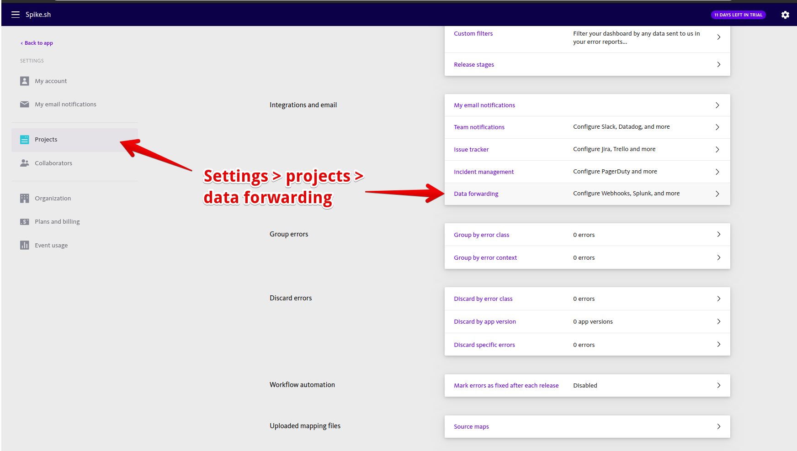
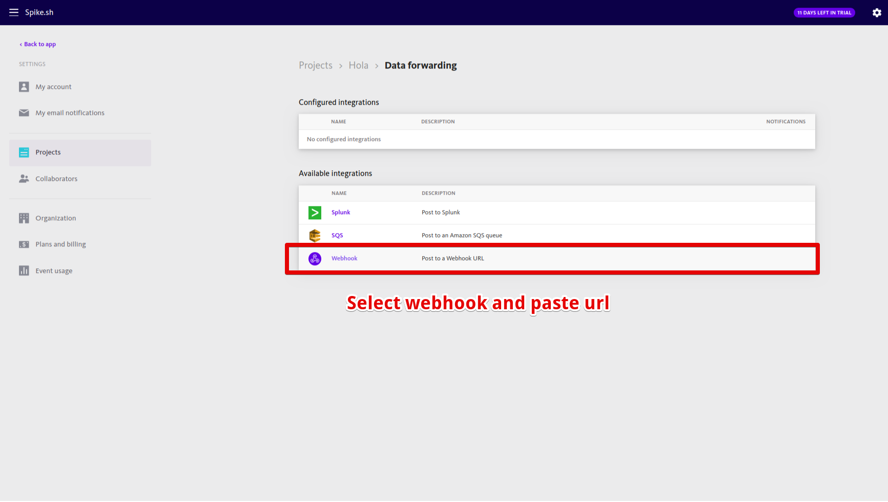

# Integrate Spike with Bugsnag

### Service and integration

With Bugsnag integration, you can -

* &#x20;Add unlimited Bugsnag integrations for each of your checks in different services
* Receive error alerts for all projects when logged on Bugsnag
* Monitor your business for all clients including tvOS
* Segment and get alerts for the right errors
* Alert the right person/team with multiple Bugsnag integrations across your services

Make sure to add the Bugsnag integration and copy the webhook.&#x20;


[create-integration-and-service-on-dashboard.md](create-integration-and-service-on-dashboard.md)


## Using the Webhook with Bugsnag

### Step 1

Choose your project and goto **Settings.** Choose **Data Forwarding** to view all the options.

### Step 2

Choose **Webhook** and paste the Spike Webhook URL


This integration auto resolves it's incidents


## FAQ

1. **How many services and integrations can I create on Spike?**
   * Unlimited
2. **How many escalation policies can I have on Spike?**
   * Unlimited

At Spike, we are working hard to integrate with all the tools your business uses. We are on a mission to help **you** identify incidents/crashes/spikes before your customers do.

If you have any integration in mind and would like us to build it for you then contact us at [support@spike.sh.](mailto:support@spike.sh)
