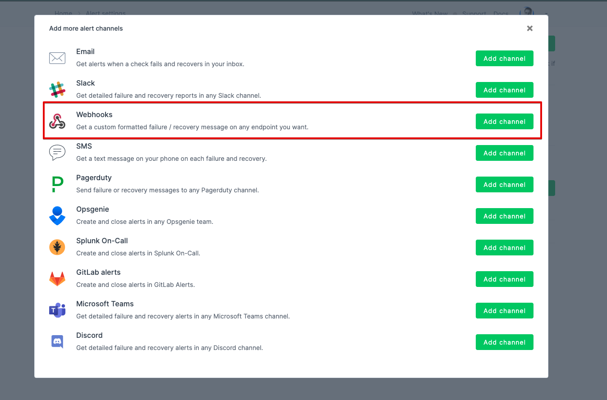

# Integrate Spike with Checkly

## Service and integration

With our Checkly integration make sure your API always responds quickly and with the correct payload. Monitor your web app's crucial transactions and get alerts. 



## Use our webhook on Checkly

Visit [Alert settings on Checkly](https://app.checklyhq.com/alert-settings) and create a new channel. 

### Step 1: 

Select webhooks



### Step 2:

Paste the webhook and the payload for our integration.


**Copy and paste the below body to Checkly's dashboard after you have pasted the webhook**

```text
{
  {{! Embeds for the SSL expiry notifications}}
  {{#eq ALERT_TYPE "ALERT_SSL" }}
    "title": "{{ALERT_TITLE}}",
    "ssl_days_remaining": "{{SSL_DAYS_REMAINING}}",
    "ssl_domain": "{{SSL_CHECK_DOMAIN}}"
  {{else}}
  {{! Embeds for the standard failure, recovery and degraded notifications}}
    "event": "{{ALERT_TITLE}}",
    "type": "{{ALERT_TYPE}}",
    "link": "{{RESULT_LINK}}",
    "id": "{{CHECK_ID}}",
    "check_type": "{{CHECK_TYPE}}",
    "name": "{{CHECK_NAME}}",
    "location": "{{RUN_LOCATION}}",
    "tags": [{{#each TAGS}} "{{this}}" {{#unless @last}},{{/unless}} {{/each}}]
  {{/eq}}
}
```


Please refrain from editing the above body. Doing so will not give you the best results in terms of alerts and auto-resolve



This integration auto-resolves all types of incidents except SSL warnings from Checkly


