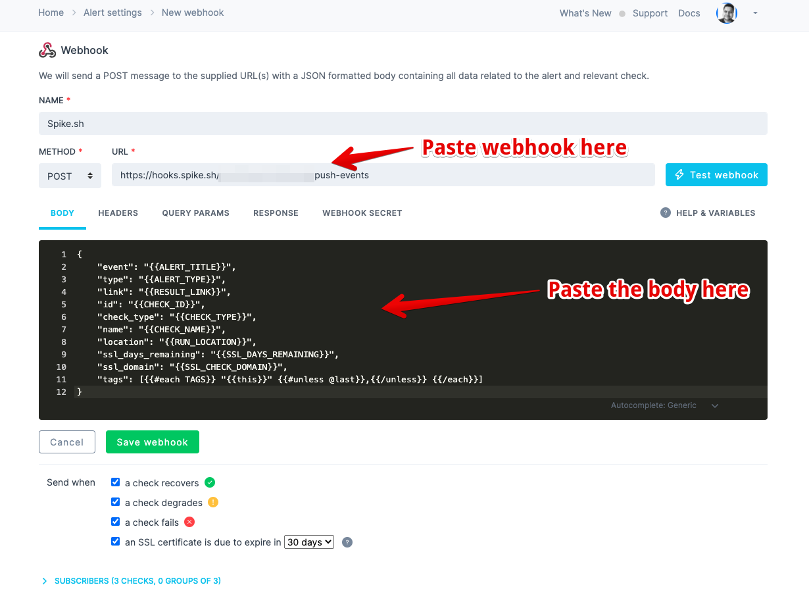

# Integrate Spike with Checkly

## Service and integration

With our Checkly integration make sure your API always responds quickly and with the correct payload. Monitor your web app's crucial transactions and get alerts.&#x20;


[create-integration-and-service-on-dashboard.md](create-integration-and-service-on-dashboard.md)


## Use our webhook on Checkly

Visit [Alert settings on Checkly](https://app.checklyhq.com/alert-settings) and create a new channel. From the list of alert channels, select Spike.sh.

Paste your integration's copied URL and paste it on Checkly. That's it. Your integration is ready to receive incidents.


This integration auto-resolves all types of incidents except SSL warnings from Checkly

