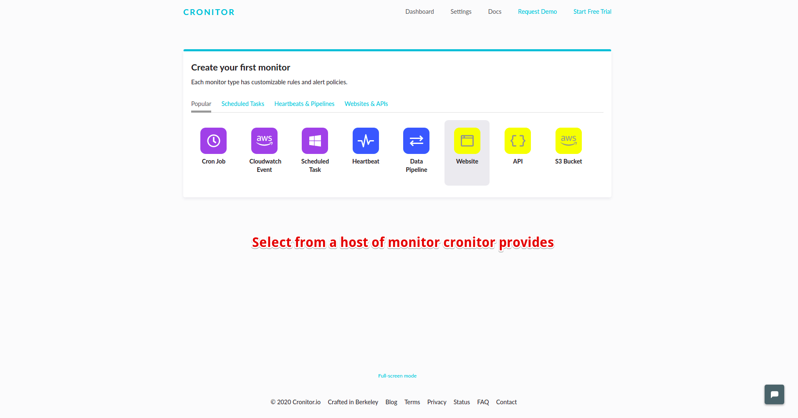
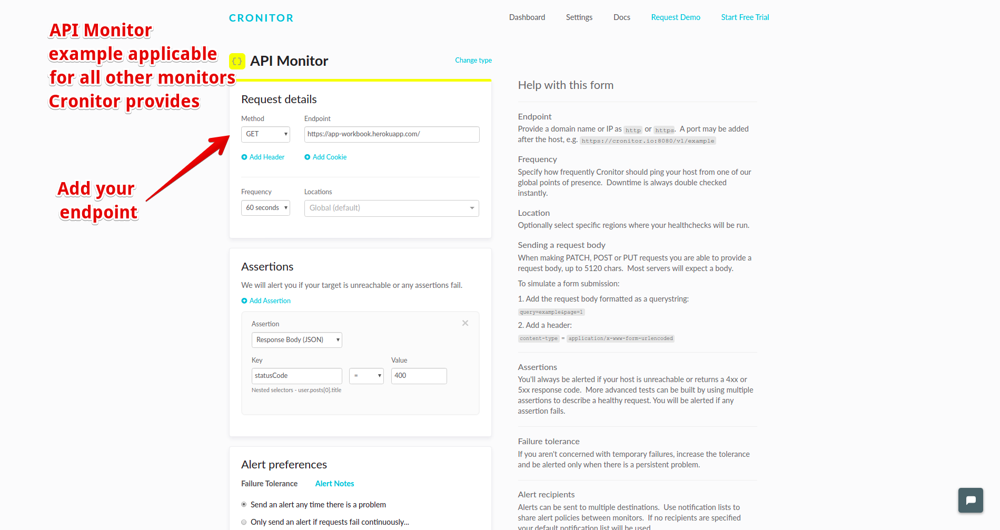
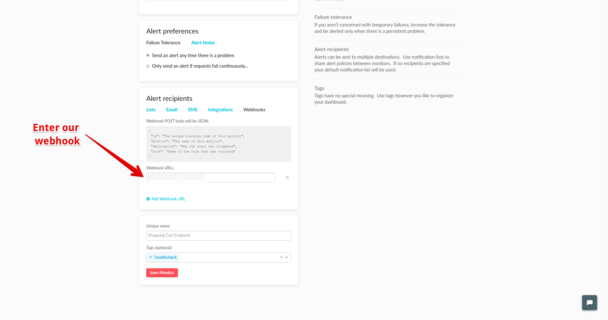

# Integrate Spike with Cronitor

### Service and integration

Make sure to add the Cronhub integration and copy the webhook. 



### Using the Webhook with Cronitor

### Step 1

From the [dashboard](https://cronitor.io/dashboard), choose the monitor

### Step 2

Configure the monitor according to the needs.

### Step 3

In the **Alert Reciepients** pannel, choose Webhook and paste the spike hooks URL here.

## FAQ

1. **How many services and integrations can I create on Spike?**
   * Unlimited
2. **How many escalation policies can I have on Spike?**
   * Unlimited

At Spike, we are working hard to integrate with all the tools your business uses. We are on a mission to help **you** identify incidents/crashes/spikes before your customers do.

If you have any integration in mind and would like us to build it for you then contact us at [support@spike.sh.](mailto:support@spike.sh)

