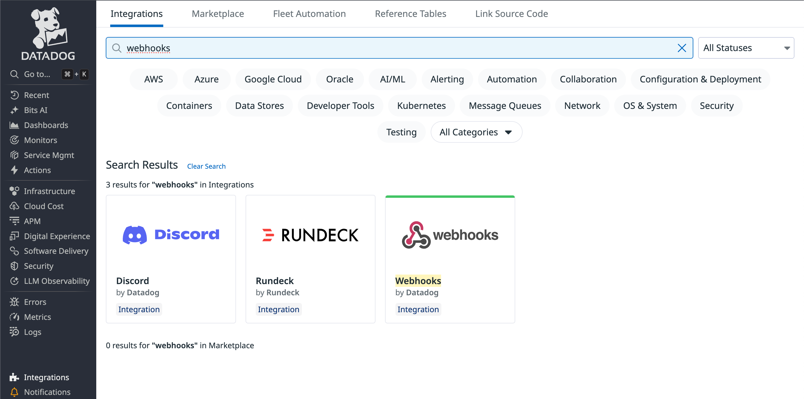
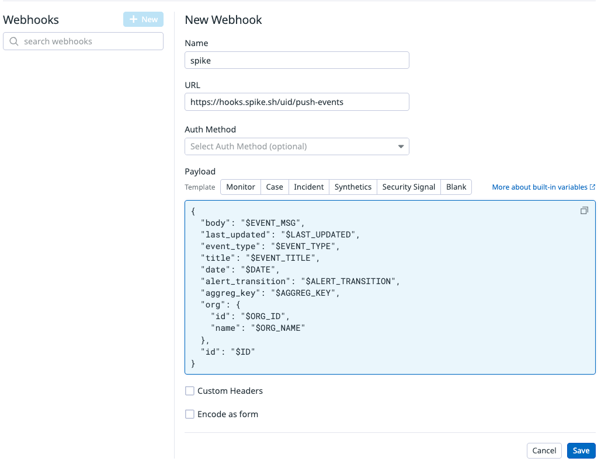
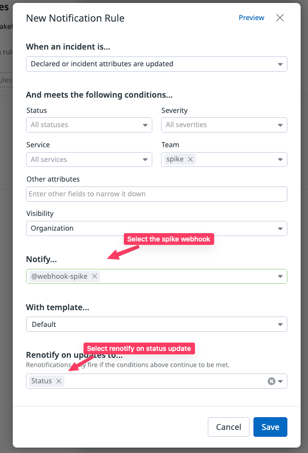

# Integrate Spike with Datadog

## Service and Integration Setup

Before proceeding, ensure you have:

1. Added the **Datadog integration** in Spike.
2. Copied the **Spike webhook URL** from the dashboard.

For details, see:

[Create Integration and Service on Dashboard](create-integration-and-service-on-dashboard.md)


---

## Configure the Webhook in Datadog

### Step 1: Open Integrations

From the **sidebar**, select **Integrations**.

.png>)

---

### Step 2: Choose Webhooks

Search for **Webhooks** in the integrations list and select it.



---

### Step 3: Create a Webhook

Fill in the details and paste your **Spike webhook URL** into the **URL field**.



---

### Step 4: Add the Payload

Copy the following payload and paste it into Datadog.
You can also customize it with any of Datadog’s template variables.


To ensure proper incident management:

1. Include **`$AGGREG_KEY`** – enables automatic resolution.
2. Include **`$ALERT_TRANSITION`** – indicates if the event is triggering or resolving.
   

```json
{ 
  "body": "$EVENT_MSG",
  "last_updated": "$LAST_UPDATED",
  "event_type": "$EVENT_TYPE",
  "title": "$EVENT_TITLE",
  "date": "$DATE",
  "alert_transition": "$ALERT_TRANSITION",
  "aggreg_key": "$AGGREG_KEY", 
  "org": {
    "id": "$ORG_ID",
    "name": "$ORG_NAME"
  },
  "id": "$ID" 
}
```

---

## Set Up Automatic Notifications

1. Go to **Incident Settings** in Datadog.
2. Click **Notification Rules** → **New Rule**.
3. Select condition:

   * `Declared or Incident attributes are updated`.
4. Configure the conditions as required.
5. In the **Notify** field, select the **webhook you created**.
6. For auto-resolution, enable **Renotify on: Status Update**.



---

At Spike, we’re committed to integrating with the tools your team already uses. Our mission is to help you detect incidents, crashes, and spikes before your customers do.

If you’d like us to build a new integration, contact us at **[support@spike.sh](mailto:support@spike.sh)**.