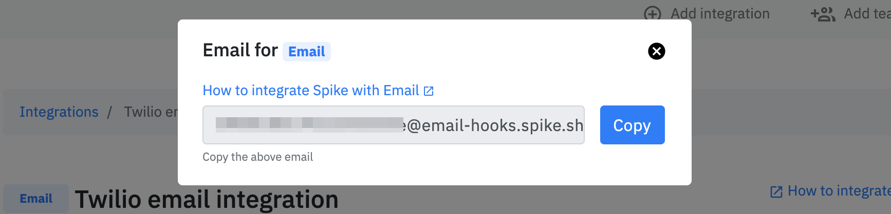
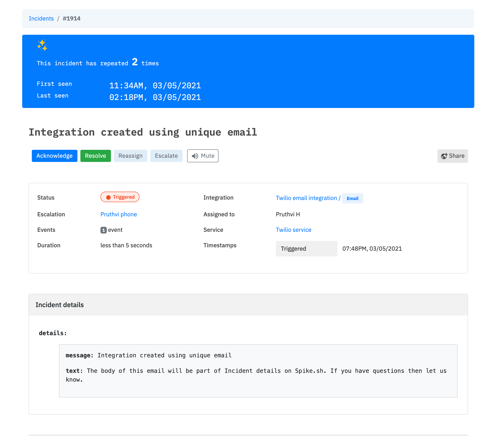

# Integrate Spike with Email

## Where to use email integration?

Many tools like DigitalOcean, Pulseway etc do not support webhooks as alert channels. In this case, you can choose to create an Email integration with Spike.sh to get incidents and relevant alerts.

## How does email integration with Spike.sh work?

Select Email from our list of integrations and use the uniquely generated email address on any tool of your choice. The emails received are managed by us for your integration. There is no inbox :)


The subject line will be the incident title and the body of email will go into incident details. 


### How to create an email integration?

#### Step 1

From the header > click [Add integration](https://app.spike.sh/integrations/new) and select **email**, give it an appropriate name create the integration.

#### Step 2

Copy the Email from the integration page.

#### Step 3

You can choose to send an email to your unique email address to test if an incident gets created.

### Example -


Email integration does not auto-resolve incidents

