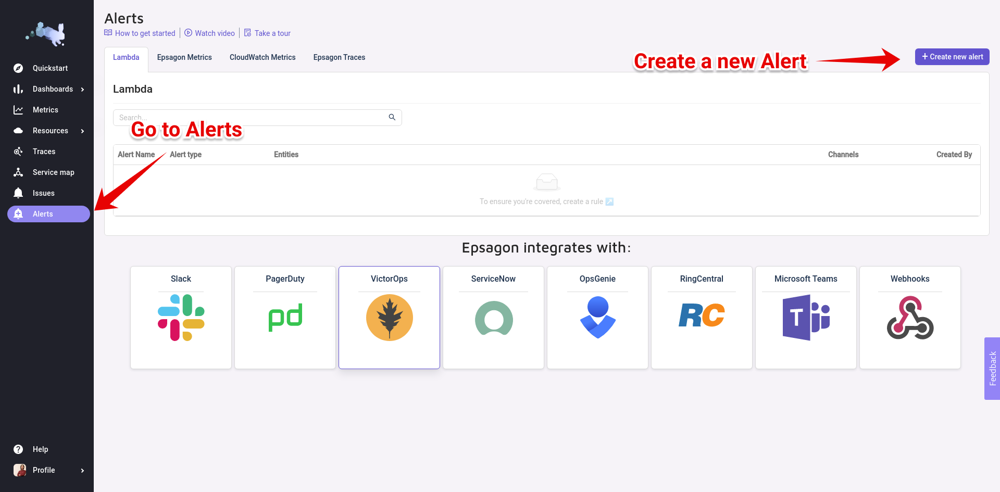

# Integrate Spike with Epsagon

### Service and integration

Make sure to add the Epsagon integration and copy the webhook. 



### 

### Using Webhooks with Epsagon

#### Step 1

On the Epsagon dashboard, navigate to the alerts page and **create a new alert**.

#### Step 2

Choose **webhook** from the dropdown list and then paste the spike webhook URL.

