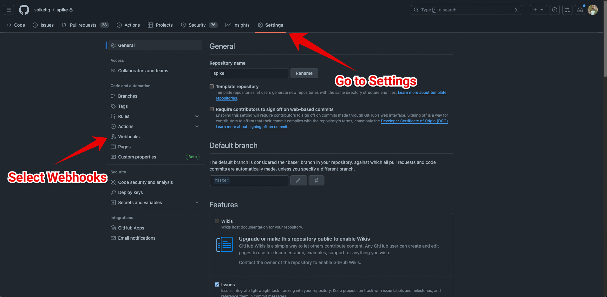
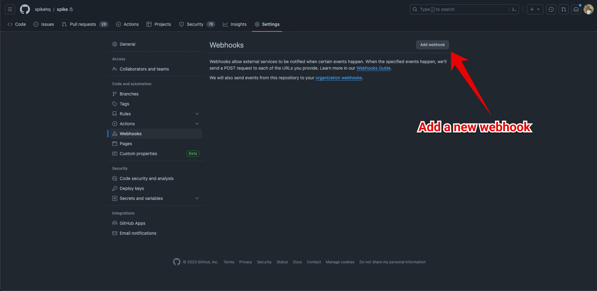
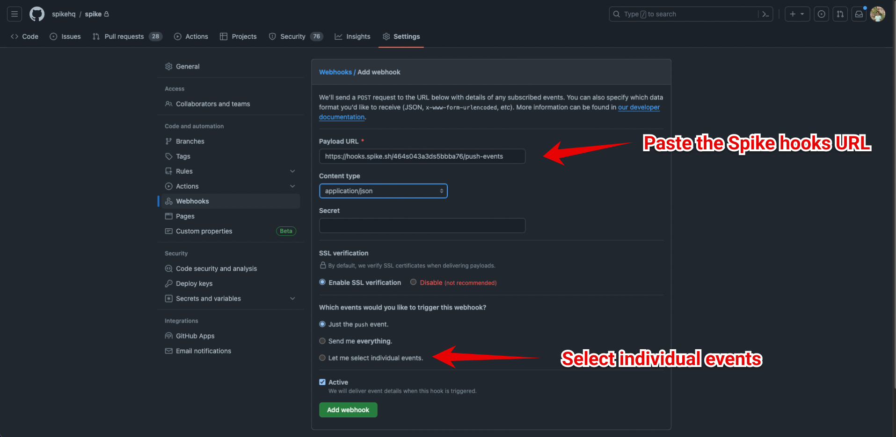
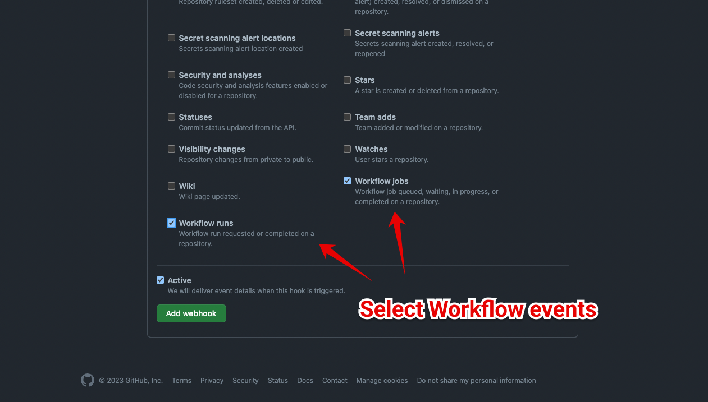

# Integrate Spike with GitHub Workflows

### Service and Integration

Create a GitHub Workflows integration and copy the unique webhook URL.


[create-integration-and-service-on-dashboard.md](create-integration-and-service-on-dashboard.md)


### Integrating with GitHub Workflows

**Step 1** 
Go to the settings section of the repository and open the webhooks settings.
<figure><figcaption></figcaption></figure>

**Step 2**
Add a new webhook.
<figure><figcaption></figcaption></figure>

**Step 3**
Paste the Spike.sh hooks URL and select content type as application/json. 
Select individual events to choose the events to monitor.
<figure><figcaption></figcaption></figure>

**Step 4**
Scroll to the bottom and select the workflow events.
<figure><figcaption></figcaption></figure>

Your integration is ready.


This integration auto resolves incidents

