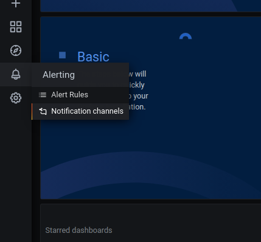
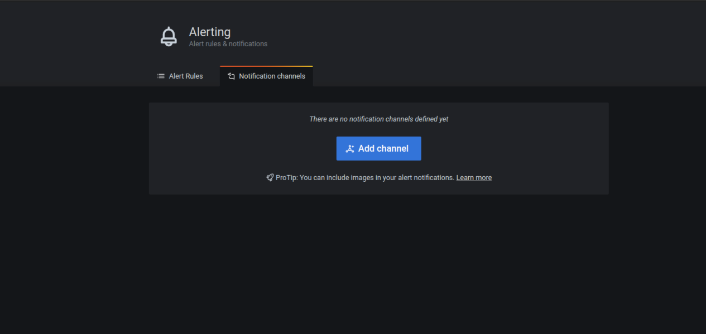
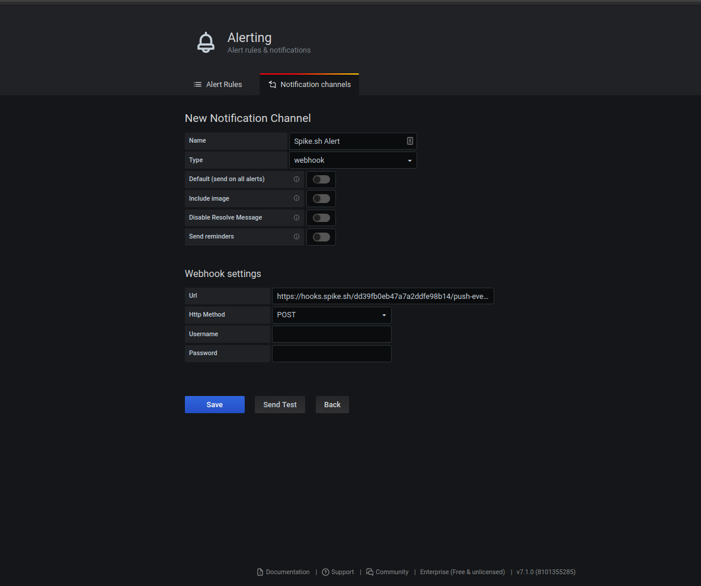

# Integrate Spike with Grafana

### Service and integration

Make sure to add the Grafana integration and copy the webhook.&#x20;


[create-integration-and-service-on-dashboard.md](create-integration-and-service-on-dashboard.md)


### Using the Webhook with Grafana

### Step 1

Select **Notification Channel** from the menu.

### Step 2

Click **Add Channel** to create a new Alerting rule.

### Step 3

Choose a Name for the channel and type to be **Webhook**.&#x20;

Paste the webhook URL under **Webhook Settings**.


This integration automatically resolves it's incidents. You will, however, need to set up the [**Ok** state in Grafana](https://grafana.com/docs/grafana/latest/alerting/create-alerts/#no-data--error-handling)


## FAQ

1. **How many services and integrations can I create on Spike?**
   * Unlimited
2. **How many escalation policies can I have on Spike?**
   * Unlimited

At Spike, we are working hard to integrate with all the tools your business uses. We are on a mission to help **you** identify incidents/crashes/spikes before your customers do.

If you have any integration in mind and would like us to build it for you then contact us at [support@spike.sh.](mailto:support@spike.sh)
