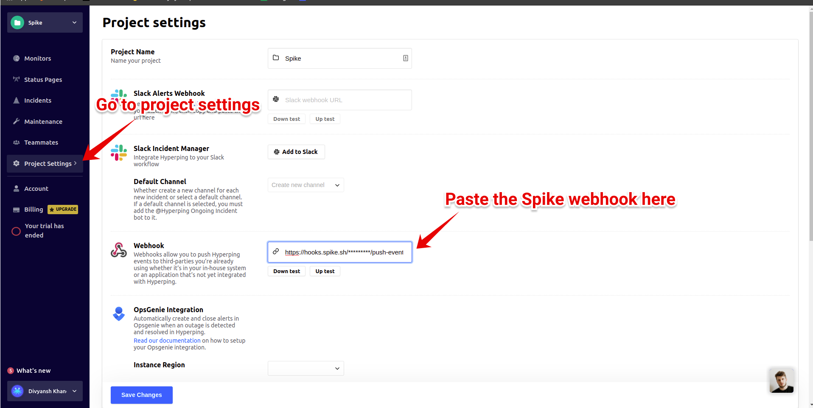

# Integrate Spike with Hyperping

### Service and integration 

Make sure to add the Hyperping integration and copying the webhook.



### Using Webhooks with Hyperping

* Navigate to the **project settings** page from the left menu.
* To configure the webhook, paste the Spike webhook URL and save.


This integration auto resolves.


