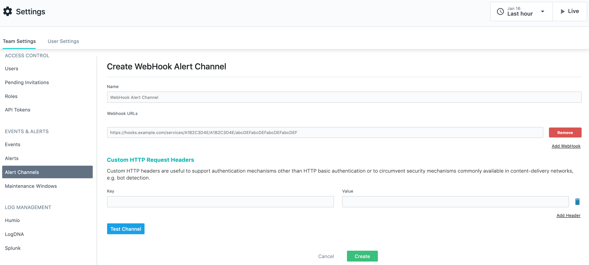

# Integrate Spike with Instana

## Service and Integration 

Make sure you have the service and integration already setup for Instana. Follow the link below on instructions of how to create integration and service.



## Use the Webhook on Instana

#### **Step 1**

From the Instana Dashboard, go to **Team Settings** and then select **Alert Channels**

**Step 2**

Create a new channel and paste the Spike Integration Webhook URL. Finally, click **Create** to save the alarm.


This integration supports auto resolution.


## FAQ

1. **How many services and integrations can I create on Spike?**
   * Unlimited
2. **How many escalation policies can I have on Spike?**
   * Unlimited

At Spike, we are working hard to integrate with all the tools your business uses. We are on a mission to help **you** identify incidents/crashes/spikes before your customers do.

If you have any integration in mind and would like us to build it for you then contact us at [support@spike.sh.](mailto:support@spike.sh)

