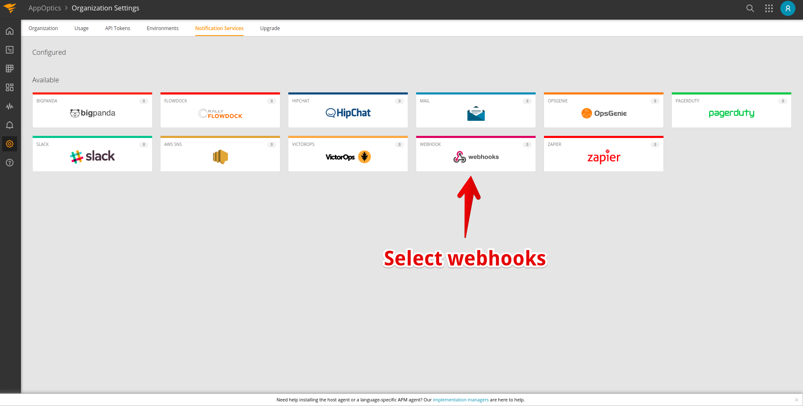
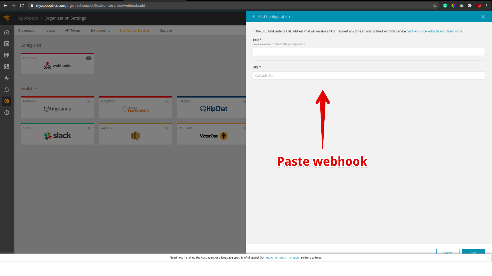

# Integrate Spike with Librato

## Service and integration

Librato is a SolarWinds product for monitoring APM, Infrastructure, logs among other things. Make sure to add the Librato integration and copy the webhook. 



## Use Webhook on Librato 

### Step 1

Open the **Settings** menu and choose **Notification Settings.**

### **Step 2**

In the Notification Settings, Select **Webhooks**

### Step 3

* Give your webhook a suitable name
* Paste the Spike Webhook URL and click Add 

At Spike, we are working hard to integrate with all the tools your business uses. We are on a mission to help **you** identify incidents/crashes/spikes before your customers do.

If you have any integration in mind and would like us to build it for you then contact us at [support@spike.sh.](mailto:support@spike.sh)

