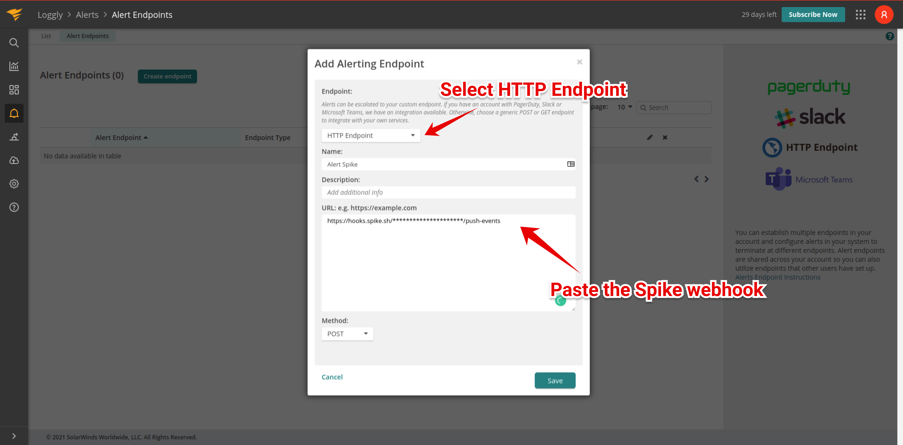

# Integrate Spike with Loggly

### Service and integration

Make sure to add the Stackify integration and copy the webhook. 



### Using Webhooks with Loggly

#### Step 1

On the alerts page, navigate to the **alert endpoints** tab. Choose to create a new endpoint.

#### Step 2

Select **HTTP Endpoint** from the dropdown. Paste the Spike webhook  URL and select the method as **POST.**

