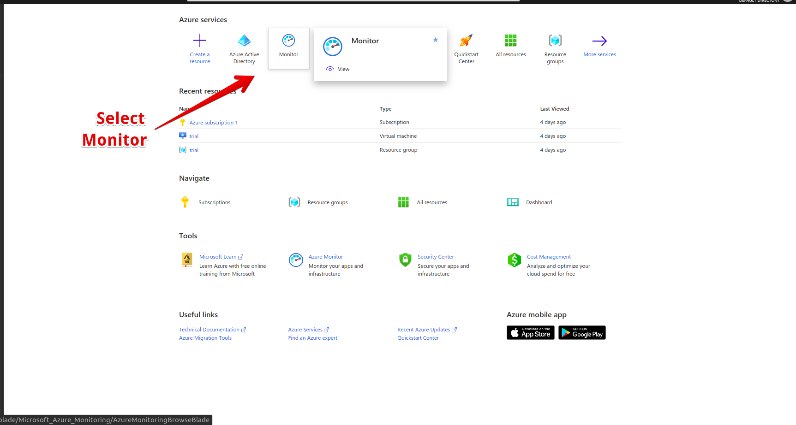
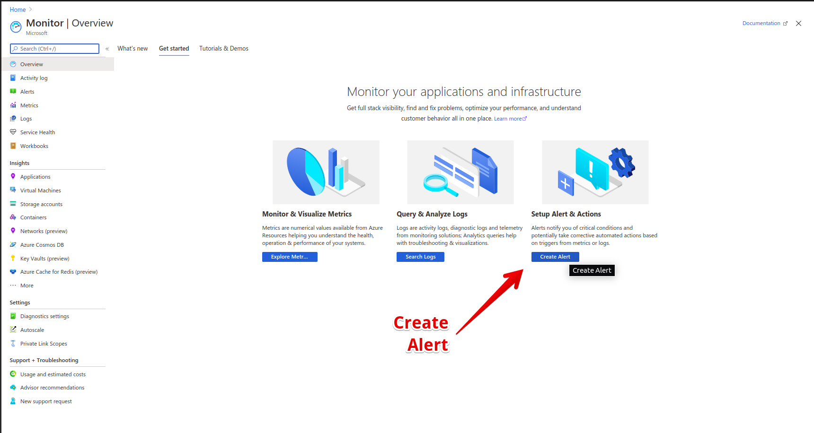
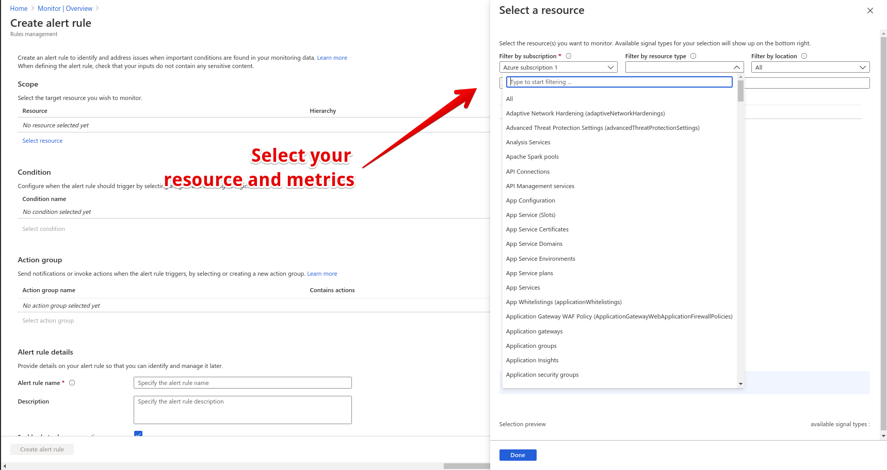
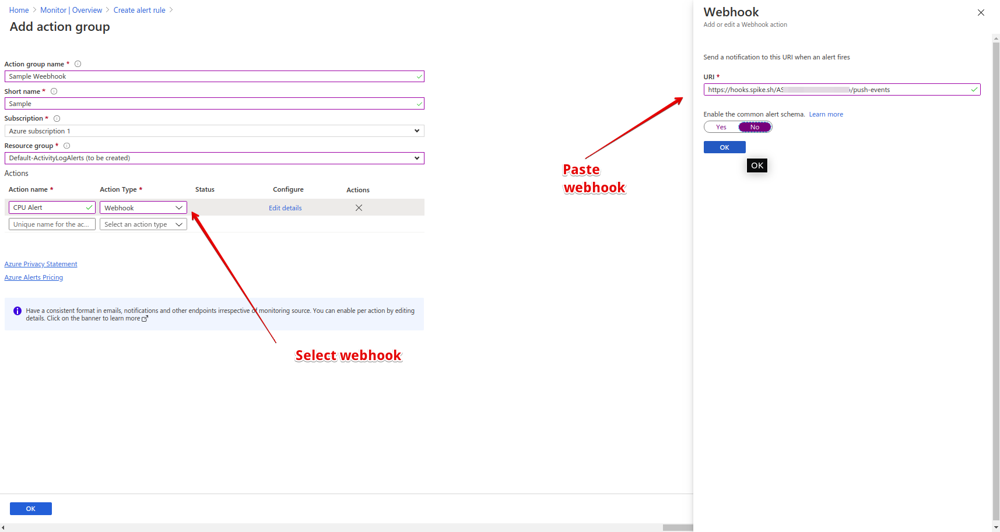
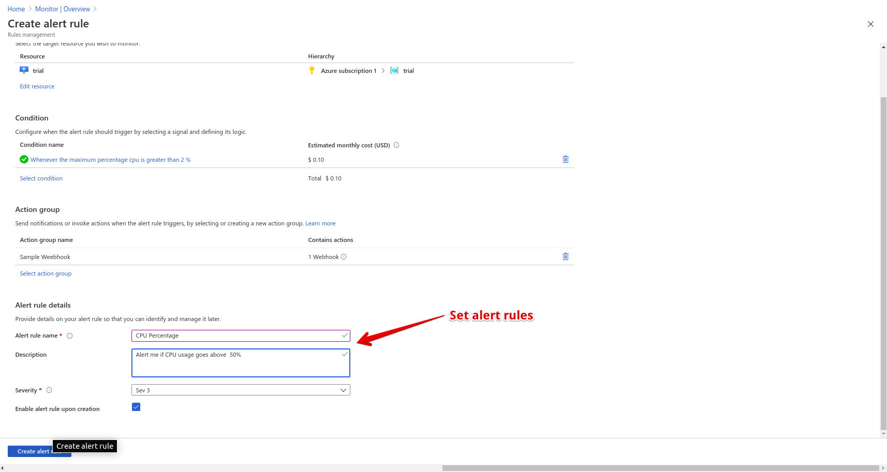

# Integrate Spike with Microsoft Azure

### Service and integration

Make sure to add the Azure integration and copy the webhook.



 


Azure Integration on Spike is capable of integrating with Azure Services like [**VMs, Application Insights** and more](https://azure.microsoft.com/en-in/services/).


### Using Webhook with Azure

### **Step 1**

 On [Azure Portal](https://portal.azure.com/#home) go to **Monitor**

### **Step 2**

On the Monitor dashboard, choose to **Create Alert**

### **Step 3**

On the Create Alert dashboard, you will be asked to configure the categories:

1. **Select A Resource** Choose a resource group you wish to monitor, for example, a Virtual Machine.
2. **Select A Condition** Choose a condition at which you wish to trigger an alert
3. **Select Action Rule** So, this is the main section which lets you integrate with webhooks. Azure allows you to paste a custom webhook URL to direct alerts to that server.

### **Step 4**

Finally, add a **description** to your alert and choose the **severity** of the alert.

## FAQ

1. **How many services and integrations can I create on Spike?**
   * Unlimited
2. **How many escalation policies can I have on Spike?**
   * Unlimited

At Spike, we are working hard to integrate with all the tools your business uses. We are on a mission to help **you** identify incidents/crashes/spikes before your customers do.

If you have any integration in mind and would like us to build it for you then contact us at [support@spike.sh.](mailto:support@spike.sh)

