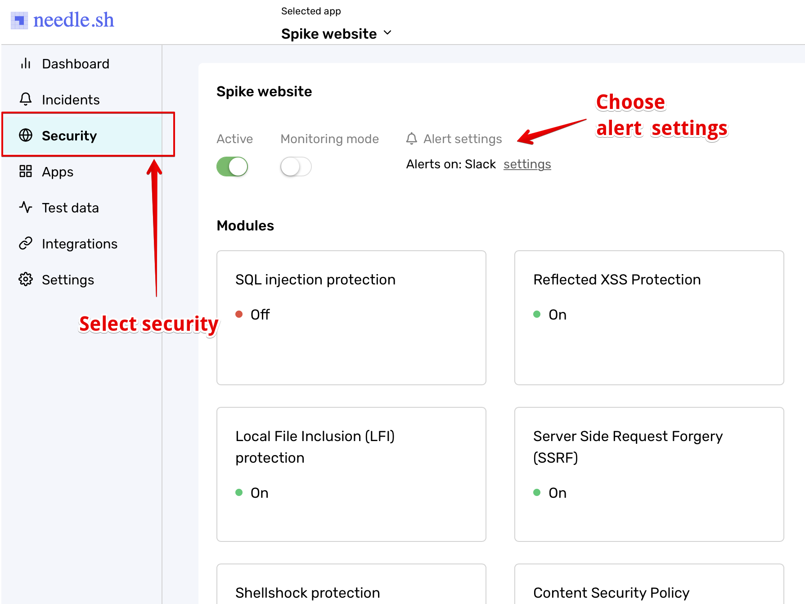
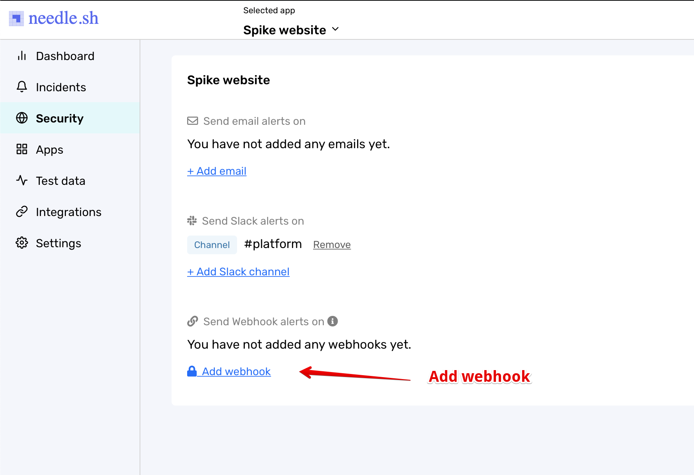

# Integrate Spike with Needle.sh

### Service and integration

Make sure to add the Needle integration and copy the webhook. 


[create-integration-and-service-on-dashboard.md](create-integration-and-service-on-dashboard.md)


### Using the webhook with Needle.sh

Go to **Security** section from the side navigation and chose **Alert Settings **option.

Chose to **Add Webhook **option from the settings and paste the spike hooks URL.

## FAQ

1. **How many services and integrations can I create on Spike?**
   * Unlimited
2. **How many escalation policies can I have on Spike?**
   * Unlimited

At Spike, we are working hard to integrate with all the tools your business uses. We are on a mission to help **you** identify incidents/crashes/spikes before your customers do.

If you have any integration in mind and would like us to build it for you then contact us at [support@spike.sh.](mailto:support@spike.sh)
