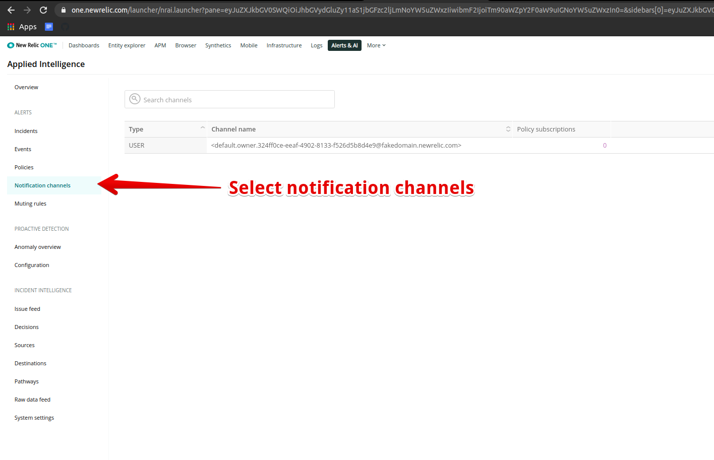
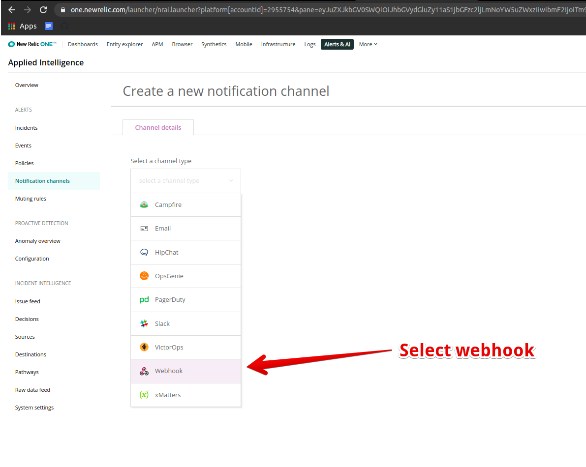

# Integrate Spike with New Relic

## Service and integration

New Relic is a platform built to help engineers analyze, troubleshoot, and optimize their entire software stack from one place.


[create-integration-and-service-on-dashboard.md](create-integration-and-service-on-dashboard.md)


## Use Webhook on New Relic

### Step 1

Start by going to **notification channels** in the left menu.



### **Step 2**

In the Notification Channel, click to create a new channel and select **Webhooks**



### Step 3

* Configure the webhook as shown in the figure and **paste the Spike.sh webhook in Base Url** input.
* Paste the custom payload from below and please make sure to not make any edits to the payload.&#x20;

```
{
    "account_id": "$ACCOUNT_ID",
    "account_name": "$ACCOUNT_NAME",
    "closed_violations_count_critical": "$CLOSED_VIOLATIONS_COUNT_CRITICAL",
    "closed_violations_count_warning": "$CLOSED_VIOLATIONS_COUNT_WARNING",
    "condition_family_id": "$CONDITION_FAMILY_ID",
    "condition_id": "$CONDITION_ID",
    "condition_name": "$CONDITION_NAME",
    "current_state": "$EVENT_STATE",
    "details": "$EVENT_DETAILS",
    "duration": "$DURATION",
    "event_type": "$EVENT_TYPE",
    "incident_acknowledge_url": "$INCIDENT_ACKNOWLEDGE_URL",
    "incident_id": "$INCIDENT_ID",
    "incident_url": "$INCIDENT_URL",
    "open_violations_count_critical": "$OPEN_VIOLATIONS_COUNT_CRITICAL",
    "open_violations_count_warning": "$OPEN_VIOLATIONS_COUNT_WARNING",
    "owner": "$EVENT_OWNER",
    "policy_name": "$POLICY_NAME",
    "policy_url": "$POLICY_URL",
    "runbook_url": "$RUNBOOK_URL",
    "severity": "$SEVERITY",
    "targets": "$TARGETS",
    "timestamp": "$TIMESTAMP",
    "timestamp_utc_string": "$TIMESTAMP_UTC_STRING",
    "violation_callback_url": "$VIOLATION_CALLBACK_URL",
    "violation_chart_url": "$VIOLATION_CHART_URL",
    "team": "DevOps"
}
```


.png>)


Customising the payload yourself might affect the incident messages, so please avoid it. Not using custom payloads will most likely cause [incident message parsing to fail](https://docs.spike.sh/incidents/why-does-message-parsing-fail)

