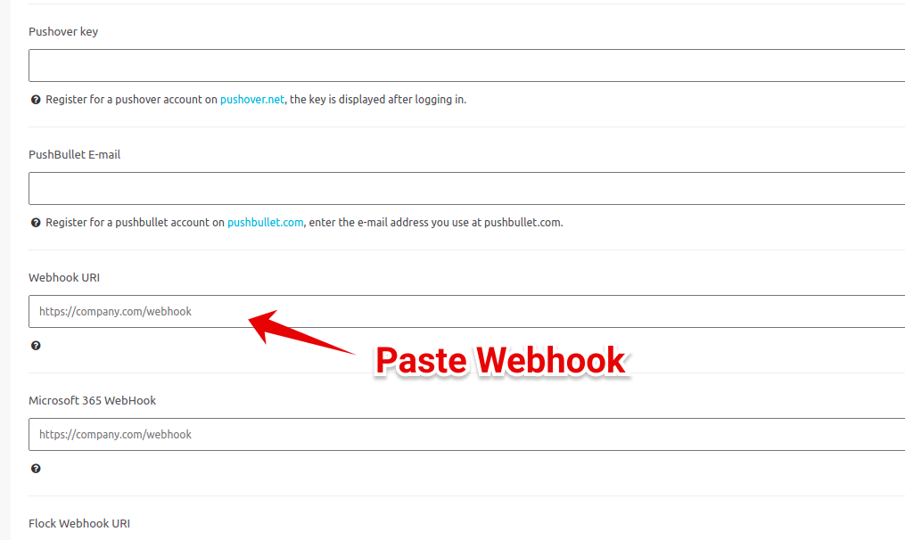

# Integrate Spike with Nixstats

### Service and integration

Make sure to add the Nixstats integration and copy the webhook. 



### Using Webhooks with Nixstats

#### Step 1

Create a new Contact

#### Step 2

Paste the spike webhook URL.


This integration auto resolves for close incidents.


At Spike, we are working hard to integrate with all the tools your business uses. We are on a mission to help **you** identify incidents/crashes/spikes before your customers do.

If you have any integration in mind and would like us to build it for you then contact us at [support@spike.sh.](mailto:support@spike.sh)

