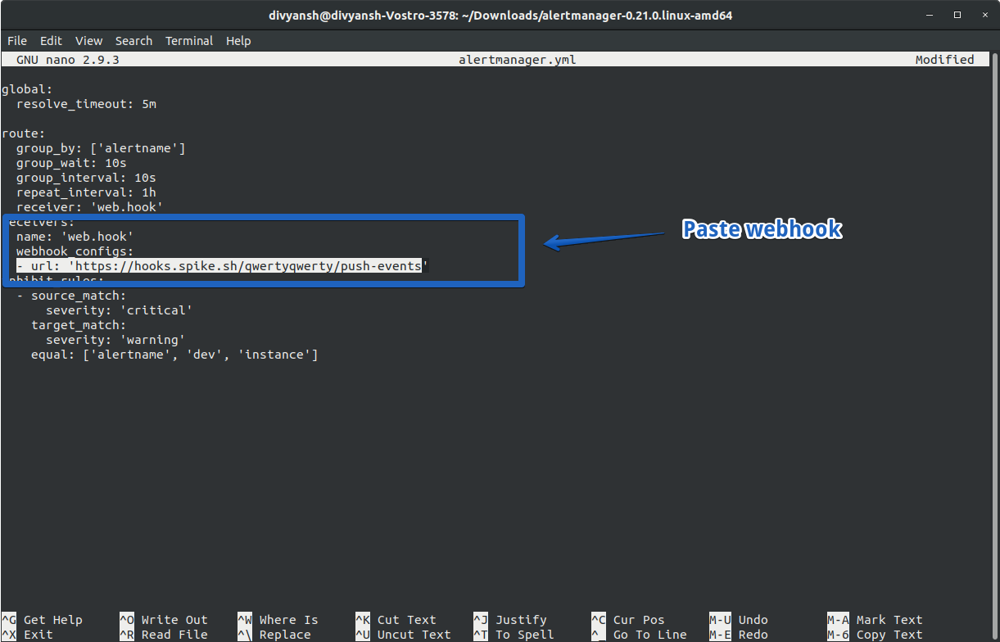

# Integrate Spike with Prometheus

### Service and integration

Make sure to add the Grafana integration and copy the webhook. 



### 

### Using the Webhook with Grafana

### Step 1

Download **Prometheus** and **Alert Monitor** from the [download page](https://prometheus.io/download/) and unzip it.

### Step 2

In the Prometheus folder, configure the `prometheus.yml` file as below.

### Step 3

Configure the `alertmanager.yml` file under alertmaager folder and paste the spike webhook as highlighted.


This integration auto resolves itself


If you have any integration in mind and would like us to build it for you then contact us at [support@spike.sh.](mailto:support@spike.sh)

