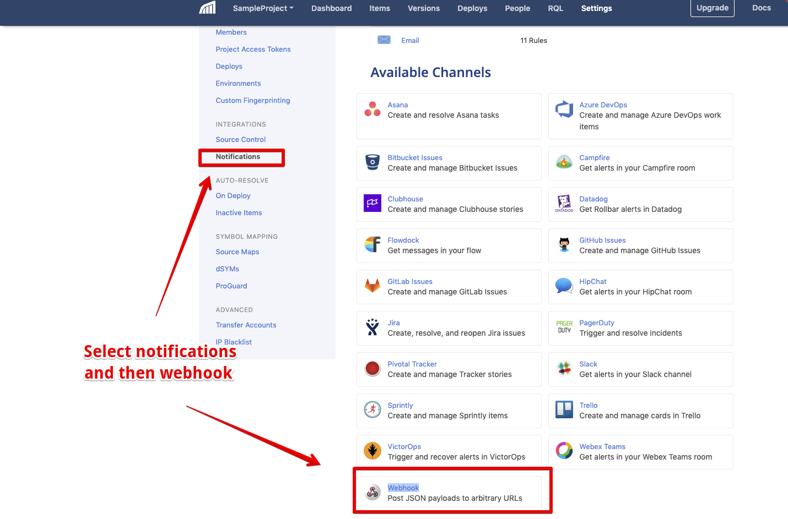
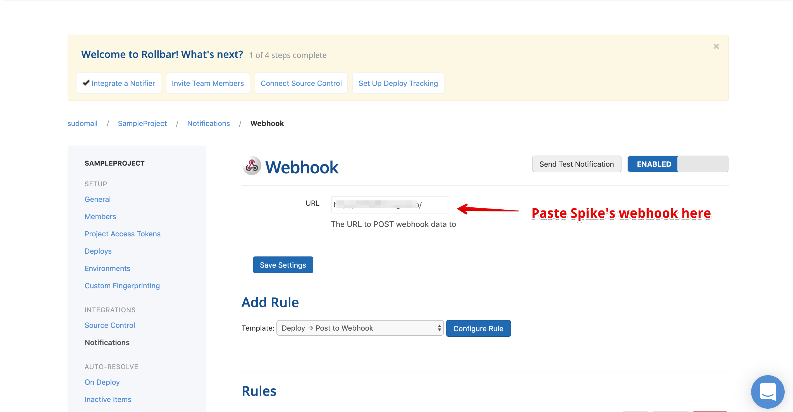

# Integrate Spike with Rollbar

## Service and Integration

Make sure you have the service and integration already setup for Rollbar. Follow the link below on instructions of how to create integration and service



## Use the webhook on Rollbar

**Step 1**

On Rollbar, visit settings &gt; Notifications and select **Webhook**

**Step 2**

Paste the webhook from Spike. You can reuse the same webhook or add more for various rules on Rollbar.

## FAQ

1. **How many services and integrations can I create on Spike?**
   * Unlimited
2. **How many escalation policies can I have on Spike?**
   * Unlimited

At Spike, we are working hard to integrate with all the tools your business uses. We are on a mission to help **you** identify incidents/crashes/spikes before your customers do.

If you have any integration in mind and would like us to build it for you then contact us at [support@spike.sh.](mailto:support@spike.sh)

