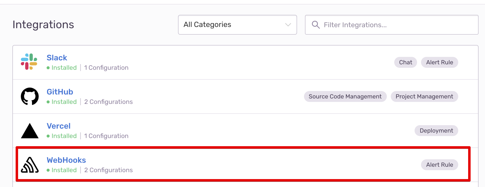

# Integrate Spike with Sentry webhook

## Service and Integration

Make sure you have the service and integration already setup for Sentry. Follow the link below on instructions of how to create integration and service


[create-integration-and-service-on-dashboard.md](create-integration-and-service-on-dashboard.md)


### What is the difference between Sentry webhook and Sentry native integration?

The main difference is in how you choose to configure and integrate on Sentry's dashboard. Here are the two approaches -

**Sentry webhook integration** takes the approach by pasting the webhook link on Sentry.

**Sentry native integration** is a 1-click install app published on Sentry.

Both Sentry webhook and Sentry native integration are created the same way you would create any other integration i.e. by going to [**New Integration**](https://app.spike.sh/integrations/new) section on dashboard.


**Which to choose from the above approaches?**\
If you can access the verified Spike.sh integration on Sentry's dashboard then take that approach. ([Instructions](https://docs.spike.sh/integrations-guideline/integrate-spike-with-sentry))\
\
Consider you have services A,B, and C to integrate with Sentry.

**Service A**: Utilize Sentry's 1-click app for a streamlined integration. Note: The 1-click app is limited to a single project on Sentry.
**Services B and C**: Establish a webhook integration by creating it on Spike (https://app.spike.sh/integrations/new) and subsequently configuring it in Sentry.

The 1-click app offers an effortless setup for one project, while the webhook integration allows for unrestricted application across multiple projects.


## Integrating with Sentry's webhook

**Step 1:** On [Sentry](https://sentry.io), go to settings > Integrations and **select Webhook**

.png>)

Paste your copied webhook from Spike.sh to Sentry's webhook integration.

.png>)


Do not forget to Enable the plugin **☝️**


**Step 2: Set up alerts**

Visit Sentry's new Alerts section from the sidebar and select **Create Alert Rule**

.png>)

Add your conditions for alerts and in actions select **Send a notification via an integration**

This should be the end result.

 (1).png>)
