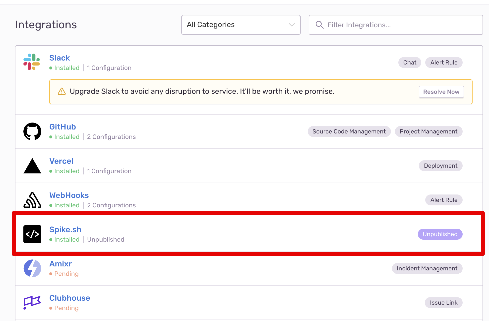

# Integrate Spike.sh with Sentry

## Service and Integration

In your Spike.sh account, make sure that you have the service and integration already setup for Sentry. You can check the link below to learn how to do that. 



This guide talks about connecting Spike.sh from inside your Sentry account with the help of Spike.sh's deep integration. If you want to use the older webhook method of connecting Sentry to Spike.sh, please use [this guide](https://docs.spike.sh/integrations-guideline/integrate-spike-with-sentry-webhook). 

## Use Spike.sh Integration on Sentry

* On [Sentry](https://sentry.io), go to settings &gt; Integrations and install **our native Spike.sh Integration.** 

* Sentry will redirect you to Spike.sh to select an existing Sentry integration that should be connected to your Sentry account. 

* Once you have installed and the installation is verified, visit Alerts section in your Sentry account and click on **Create Alert rule.**

* Add your conditions for alerts and in actions select **Send a notification via an integration and then Select Spike.sh.**

* You can test the integration alerts by generating a new error on Sentry. 

If you face any issues then please ping us from this page or email at [support@spike.sh](mailto:support@spike.sh)

