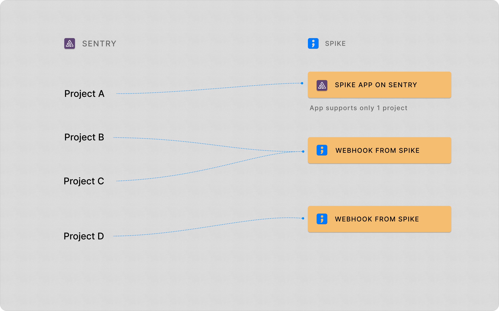
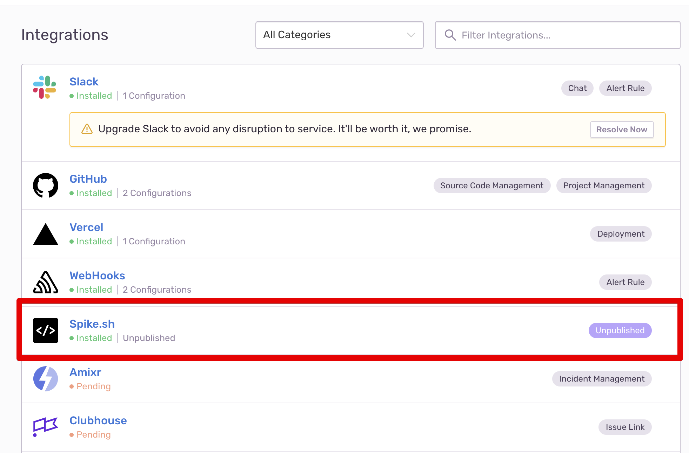
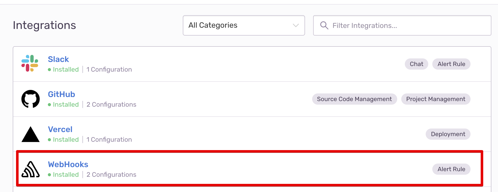
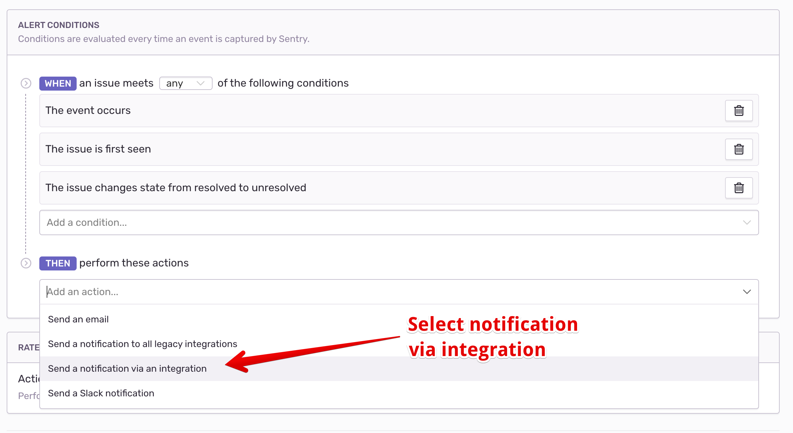

# Integrate Spike with Sentry
[Sentry](https//sentry.io) is a powerful error monitoring and performance tracking platform designed for developers. It provides real-time insights into application issues, helping teams identify, troubleshoot, and resolve errors quickly. With detailed stack traces, performance metrics, and contextual data, Sentry ensures that you can proactively manage your application's health and deliver a seamless user experience.

## Overview
The Spike integration with Sentry bridges error monitoring and incident response. Connect Sentry to Spike to automatically trigger real-time incident alerts for critical errors.

You can setup Spike with Sentry in two ways. 

1. Single-click install on Sentry
1. Connect with Spike webhook (_paste webhook on Sentry_)

### Integrating with multiple projects on Sentry

To integrate multiple projects on Sentry with Spike, you will need to use both Spike app on Sentry and the webhook integration. 

Consider you have services A,B, and C to integrate with Sentry.

**Service A**: Utilize Sentry's 1-click app for a streamlined integration. This is limited to a single project on Sentry.

**Services B, C and so on..**: Establish a webhook integration by creating it on [Spike](https://app.spike.sh/integrations/new) and subsequently configuring it in Sentry.

The 1-click app offers an effortless setup for one project, while the webhook integration allows for unrestricted application across multiple projects.

## How to set up?
To set up, you will need a Sentry integration on Spike no matter which way you choose. So please make sure you have created one on [Spike](https//app.spike.sh/integrations)

### 1. Single-click install on Sentry


* **Install and connect**
    * On Sentry, go to settings > Integrations
    * Locate the Spike integration and click to begin setup.
    * Sentry will redirect you to Spike, where you can select an existing Sentry integration to connect with your Sentry account.
    * Choose your integration on Spike and complete the installation process.
* **Route alerts from Sentry**
    * Once the installation is verified, go to the Alerts section in Sentry and configure alert rules to start receiving alerts on Spike.
    * Add your conditions for alerts and in actions select **Send a notification via an integration and then Select Spike.**


* On Sentry, go to settings > Integrations and install our native Spike Integration 

* Sentry will redirect you to Spike to select an existing Sentry integration that should be connected to your Sentry account. 

* Once you have installed and the installation is verified, visit Alerts section in your Sentry account and click on **Create Alert rule.**

* Add your conditions for alerts and in actions select **Send a notification via an integration and then Select Spike.**




* Test by generating a new error on Sentry.

### 2. Integrating with Sentry's webhook



* **On Sentry**
    * On your Sentry account, navigate to Settings > Integrations and select Webhook.
    * Paste the webhook URL copied from Spike into the Webhook field in Sentry's integration settings.
    * Enable the plugin to activate the integration.
* **Configure alert rules**
    * Go to the Alerts section in the Sentry sidebar and select Create Alert Rule.
    * Define the conditions under which alerts should be triggered.
    * In the Actions section, select Send a notification via an integration and choose the Spike webhook integration.


**Step 1:** On [Sentry](https://sentry.io), go to settings > Integrations and **select Webhook**

Paste your copied webhook from Spike to Sentry's webhook integration.


Do not forget to **Enable** the plugin


**Step 2: Set up alerts**

Visit Sentry's new Alerts section from the sidebar and select **Create Alert Rule**

Add your conditions for alerts and in actions select **Send a notification via an integration**

This is how the end result might look




* Test by generating a new error on Sentry.

## FAQs

Why create a Sentry integration on Spike?

Creating a Sentry integration on Spike allows you to group and suppress incidents effectively, ensuring better incident management.

Is there a limit on Sentry integrations?

**Single-click install**: Only one integration is allowed per Sentry account.  
**Sentry webhook integration**: Unlimited integrations are supported.

