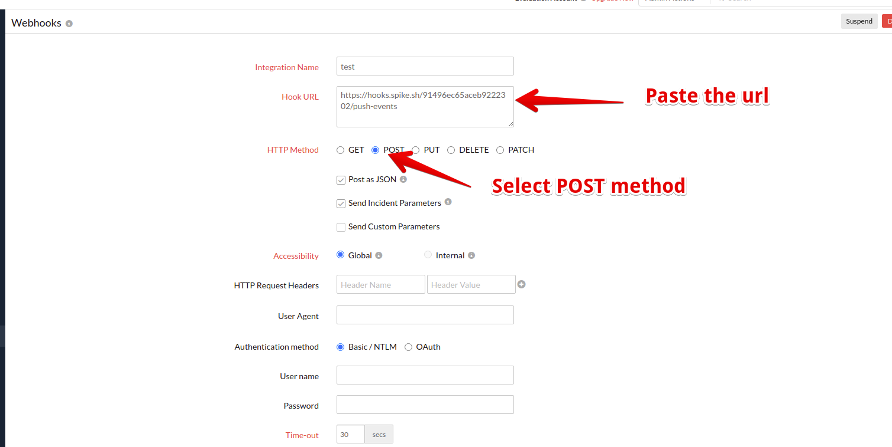

# Integrate Spike with Site24x7

### Service and integration

Make sure to add the Site24x7 integration and copy the webhook. 



### 

### Using the Webhook with Site24x7

### Step 1

Login to Site24x7 Dashboard.

### Step 2

From the left panel, open the Admin panel and choose **Third-party Integrations**.

### Step 3

Select Webhooks from the integrations window. 

### Step 4

Paste the Spike.sh webhook link. Make sure to mark the HTTP method as **POST** and **post as JSON.**


This integration supports auto-resolution of incidents


