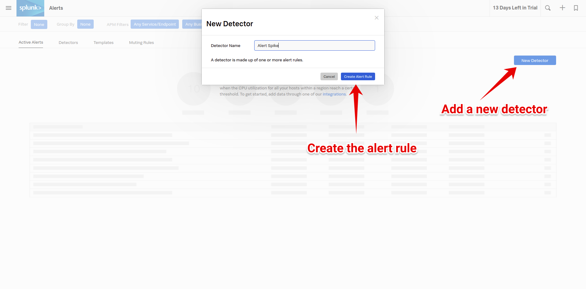
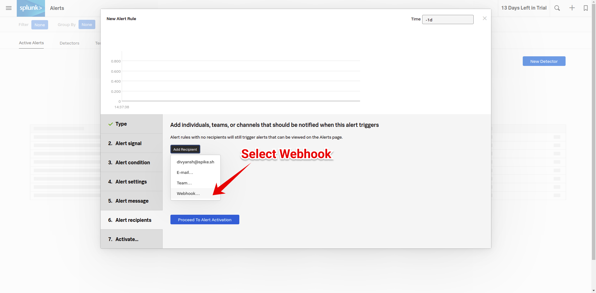

# Integrate Spike with Splunk

Service and integration

Make sure to add the Splunk integration and copy the webhook.



### Using Webhooks with Splunk

#### Step 1

Go to the **Alerts** page from the left menu.

#### Step 2

Add a new **detector** and then create a new alert rule for Spike.

#### Step 3

From the alert recipients, choose webhooks from the dropdown to customize it.

#### Step 4

Paste the Spike webhook URL and save.


This integration auto resolves.


