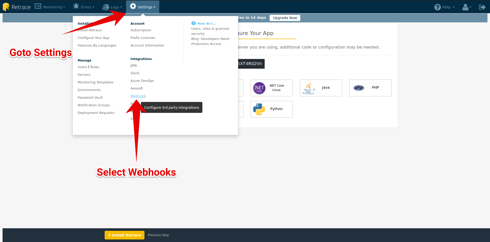

# Integrate Spike with Stackify

### Service and integration

Make sure to add the Stackify integration and copy the webhook. 



### Using the Webhook with Stackify

### Step 1

Login to the dashboard. Open **Settings** and select **Webhooks** under Integrations menu

### Step 2

Add a new Webhook.

### Step 3

Paste the Spike.sh Webhook link.

