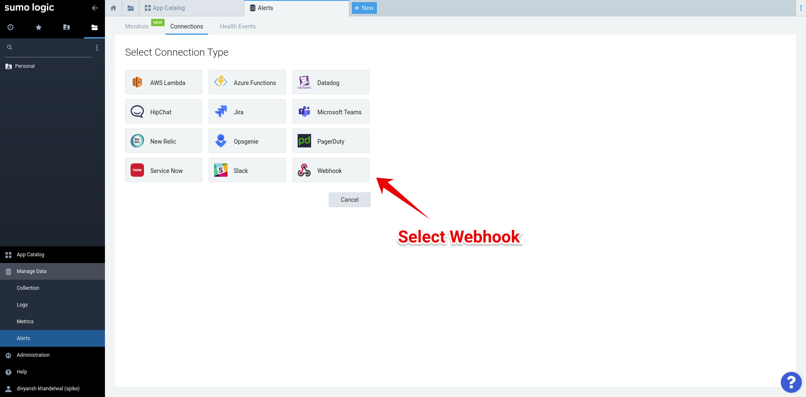

# Integrate Spike with Sumo Logic

### Service and integration

Make sure to add the Sumo Logic integration and copy the webhook. 




### Using Webhooks with Sumo Logic

**Step 1**

Navigate to the alerts page and open the connections tab.


**Step 2**

Select the webhook connection type.




**Step 3**

Paste the Spike webhook URL and the JSON provided below.


```text
{
    "Name": "{{Name}}",
    "Description": "{{Description}}",
    "MonitorType": "{{MonitorType}}",
    "Query": "{{Query}}",
    "QueryURL": "{{QueryURL}}",
    "ResultsJson": "{{ResultsJson}}",
    "NumQueryResults": "{{NumQueryResults}}",
    "Id": "{{Id}}",
    "DetectionMethod": "{{DetectionMethod}}",
    "TriggerType": "{{TriggerType}}",
    "TriggerTimeRange": "{{TriggerTimeRange}}",
    "TriggerTime": "{{TriggerTime}}",
    "TriggerCondition": "{{TriggerCondition}}",
    "TriggerValue": "{{TriggerValue}}",
    "TriggerTimeStart": "{{TriggerTimeStart}}",
    "TriggerTimeEnd": "{{TriggerTimeEnd}}",
    "SourceURL": "{{SourceURL}}"
}
```

