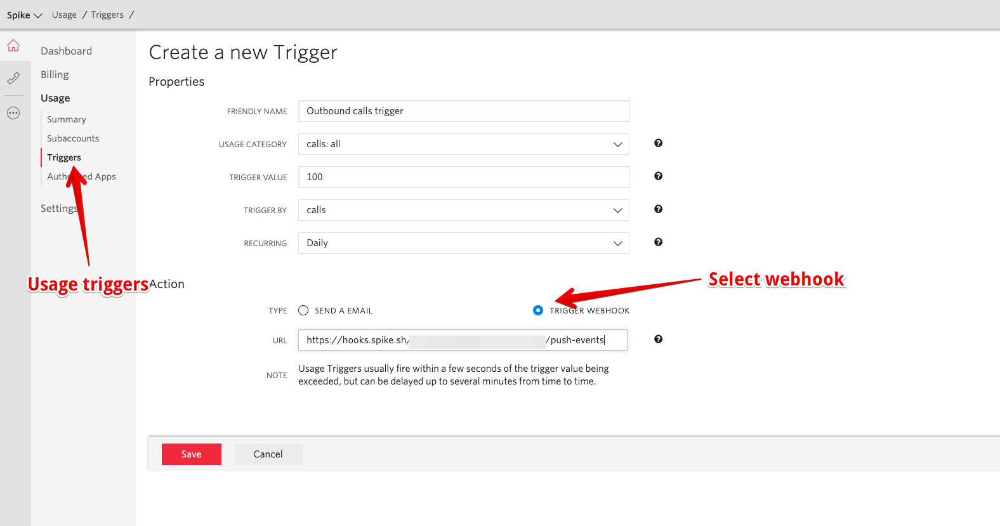

# Integrate Spike with Twilio

### Service and integration

Make sure to add the Twilio integration and copying the webhook.&#x20;


[create-integration-and-service-on-dashboard.md](create-integration-and-service-on-dashboard.md)


### Using the webhook on Twilio

On [Twilio](https://twilio.com/console) console, setup **debugger and usage triggers**

**Usage triggers**

On the console, visit **Usage > Triggers**. You can setup multiple triggers with various webhooks.&#x20;

**Debugger alerts**

On the side panel, click on **All products & services > Runtime > Debugger.** You can setup multiple triggers with a single or more webhooks.&#x20;

 (1).png>)

## FAQ

1. **How many services and integrations can I create on Spike?**
   * Unlimited
2. **How many escalation policies can I have on Spike?**
   * Unlimited

At Spike, we are working hard to integrate with all the tools your business uses. We are on a mission to help **you** identify incidents/crashes/spikes before your customers do.

If you have any integration in mind and would like us to build it for you then contact us at [support@spike.sh.](mailto:support@spike.sh)
