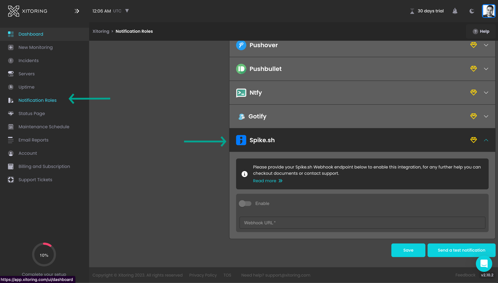

# Integrate Spike with Xitoring

<figure><figcaption></figcaption></figure>

[Xitoring](https://xitoring.com) is a comprehensive monitoring platform designed to help teams keep track of server health, uptime, and overall system performance. With Xitoring, you can monitor the availability and performance of your servers, applications, and websites, receiving instant notifications when something goes wrong. This ensures that you can quickly respond to and resolve issues, maintaining the reliability and performance of your infrastructure.

## Incident alerts from Xitoring

By integrating Xitoring with Spike, you can receive real-time alerts for various monitoring-related incidents, including:

* Server Downtime: Alerts when a server goes down, allowing you to respond promptly and minimize downtime.
* Performance Issues: Notifications when performance metrics, such as CPU usage or memory load, exceed predefined thresholds, helping you maintain optimal system performance.
* Uptime Checks: Alerts when uptime checks fail, ensuring that your websites and services remain accessible.

This integration keeps you informed about critical issues with your infrastructure, enabling you to take immediate action to resolve them.


Auto-resolution is supported for this integration. Spike will also automatically group repeated incidents and suppress alerts while incident is open.


### Service and Integration

**Step 1:** Create a Xitoring integration and copy the unique webhook URL.


[create-integration-and-service-on-dashboard.md](create-integration-and-service-on-dashboard.md)


**Step 2:**



* **Navivate to Notification**
  * Visit [Notification Roles](https://app.xitoring.com/ui/notificationRoles)
  * Click Spike.sh > Paste webhook

<figure><figcaption></figcaption></figure>


