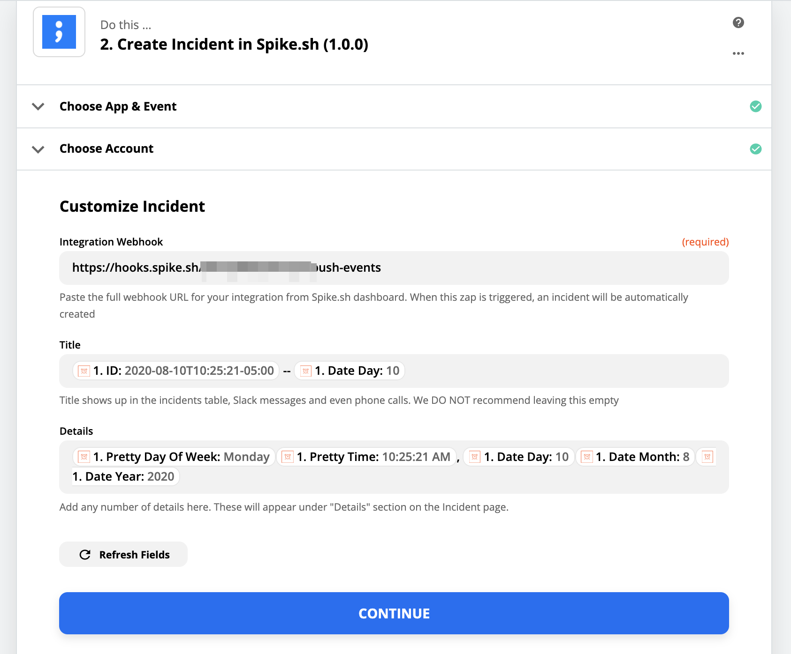

# Integrate Spike with Zapier

## Service and Integration

Make sure you have the service and integration already setup for Zapier. Follow the link below on instructions of how to create integration and service.



## Creating a zap

Click on **Create zap** \([what is a zap?](https://zapier.com/help/create/basics/learn-key-concepts-in-zapier)\) on Zapier's dashboard. You can choose to have Spike as a **trigger** and also as an **action**


Use Spike.sh's Zapier app to [setup triggers and actions here](https://zapier.com/apps/spikesh/integrations).


**Trigger**  
We invoke a zap every time a new incident is created for integrations of your choice. You can choose to then automate sending an email to affected customers or trigger Amazon Alexa and even change your room's colour to set the mood.

Here are some example zaps for our **trigger**. Do this for every new incident on Spike integration 👉

1. Send email to affected customers
2. Send a message on Discord or Rocket.chat
3. Make the light bulb change the colour or blink 🧐
4. Create issues on your tracking platform like JIRA or [Linear.app](https://linear.app)

**Action**  
You can choose to create an incident from [one of hundreds of Zapier apps](https://zapier.com/apps). Here are some example zaps for our **action**. Create an incident for 👉

1. Failed payments from Stripe
2. Custom queries with MySQL or Postgresql
3. DigitalOcean alerts for scaling, etc.

## **Authentication with Zapier**

You can securely authenticate on Zapier using your API key 🔑. Head over to your API inside settings on our dashboard and generate a new key\(recommended\) over using an already existing one for Zapier.

Use this key to authenticate by pasting on Zapier.


Don't have API enabled on your account yet? email us at [support@spike.sh](mailto:support@spike.sh) or chat with us from this page.


## Trigger

You will need to paste the full webhook URL on Zapier for an integration you want. Head over to your [integrations page](https://app.spike.sh/integrations) and copy the webhook for integration of your choice to automate.

## Action

As with trigger, you will need to past the full webhook URL on Zapier to create an incident for your integration. We recommend adding webhook of Zapier integration on Spike.


Adding webhook URL of non-zapier integration from Spike will create incidents and trigger alerts but _might not_ give you the right message on Phone call and Slack.


**Title**  
The title input field for our action is the incident title. It is used in phone calls, SMS and Slack too. Please choose the title from options Zapier would provide. _We do not recommned leaving this field empty_.

**Details**  
All the additional details for you and your team to learn more about the incidents go in this field.

Queries? Let us know, we are always happy to help.

