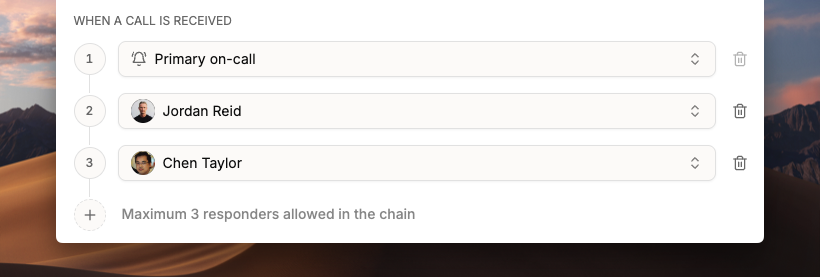
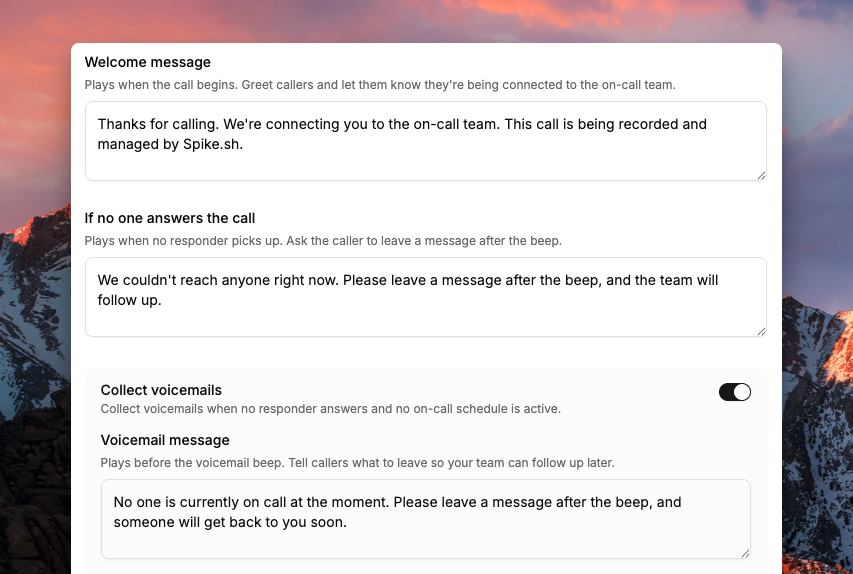
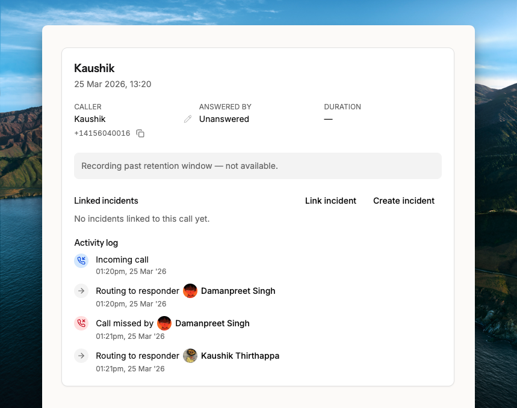

<figure><figcaption></figcaption></figure>

# Live Call Routing

Live Call Routing gives your team a dedicated phone number that routes incoming calls to the on-call engineer. It captures human-reported incidents: a security vendor flagging a breach, or a payment partner reporting a failure. The caller connects directly to whoever is on-call.


Live Call Routing is available on **all paid plans**.


## How Live Call Routing works

<figure><figcaption>
Incoming calls route through on-call and fallback responders.
</figcaption></figure>

Spike uses your on-call schedules to determine who receives calls.

- An incoming call first rings the configured on-call responder.
- If there is no answer, it rings fallback responder 1.
- If still unanswered, it rings fallback responder 2.
- If no one answers, Spike plays your configured **No Answer** message and takes a message from the caller.


Voicemail pickup counts as an answered call. Spike will not route to a fallback responder in this case.


Every call is recorded and logged. A detailed alert is sent to your configured Slack or Microsoft Teams channels.

## How to set up Live Call Routing

Visit [Live Call Routing](https://app.spike.sh/call-routing) on the dashboard to get started.

Live Call Routing works with any phone number from Twilio or Plivo. Use an existing number you already own, or purchase a new one directly from Twilio or Plivo.

Your number stays completely private. Spike does not require API keys or direct access to your account.


To get a number directly from Spike, email [support@spike.sh](mailto:support@spike.sh).


 lcr-with-twilio.md 
 lcr-with-plivo.md 



### Add your phone number

Enter your phone number in full international format, including the `+` symbol. Give it a clear name (e.g., *Engineering Hotline*) for easy identification.


Find your number in Twilio under **Console → Develop → Phone numbers → Active numbers**, or in Plivo under **Numbers → Active**.



### Configure who receives the calls

Select an on-call schedule or a specific responder. Optionally add up to two fallback responders.


### Customize your messages

Set up three audio messages:
- **Welcome message**: played when someone calls.
- **No one on-call message**: played if no one is currently on call.
- **No answer message**: played if all responders fail to answer.


### Connect your Twilio or Plivo account

Spike provides a webhook URL. Paste it into your Twilio or Plivo console as per their instructions.


### Go live

Your phone number is now ready to start routing calls.



## Call recording setup

When call recording is enabled, Spike retrieves recordings directly from your Twilio or Plivo account. To play recordings inside Spike, disable **HTTP Basic Authentication for media access** in your provider's settings.



In your Twilio Console, go to **Develop → Voice → Settings → General**. Under **HTTP Basic Authentication for media access**, select **Disable**.


In your Plivo Console, go to **Voice → Settings → Other Settings**. Under **HTTP Basic Authentication for media access**, select **Disable**.



## Customize messages

<figure><figcaption>
Configure the three audio messages for your phone line.
</figcaption></figure>

Spike plays audio messages at key points during a call. Configure three types:

### Welcome message

Played as soon as the call begins. Use it to greet callers and let them know they're being connected to the on-call team.

*Example: "Hi, thanks for calling the Engineering Hotline. Please hold while we connect you to the on-call engineer."*

### No one answered message

Played when no one answers after trying the primary and fallback responders. Ask the caller to leave a voicemail after the beep.

*Example: "Sorry, no one is available to take your call right now. Please leave a message and we'll get back to you as soon as possible."*

### No one on-call message

Played when there is no on-call responder at the moment.

*Example: "Our on-call team is currently offline. Please leave a message with your name and number, and we'll return your call as soon as we're back on shift."*

## Call logs and recordings

<figure><figcaption>
All calls appear in the Call Logs section of your dashboard.
</figcaption></figure>

All calls appear in the **Call Logs** section of your dashboard. Each log entry includes:

- Caller information
- Who answered (or if unanswered)
- Fallback activity (e.g., "Primary did not answer → routed to Secondary")
- Duration of the call
- A link to the audio recording
- Detailed activity log
- Link to incidents

From the log, you can:
- Review the call for post-incident analysis
- Create or link incidents directly from the log
- Archive or delete entries when no longer needed

## Test mode

Before going live, test your setup:

1. Enable **Test Mode** for 5 minutes.
2. During this time, all calls route directly to you.
3. Ask a colleague to call your number and confirm that routing, fallback, and messages work as expected.

## FAQs

### How many fallback responders can I add?

Up to 2 fallback responders.

### I don't have a Twilio or Plivo account. How can I get started?

Email [support@spike.sh](mailto:support@spike.sh). The Spike team can help with setup.

### What happens if no one is on-call?

The caller hears your configured **No one on-call message**. Spike takes a message and creates a call log.

### Can I review past calls?

Yes. All calls are logged with full details and a recording in the **Call Logs** section.

### Can I have a transcript of my call?

Not yet. Transcripts aren't available currently.
